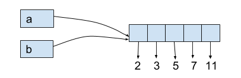
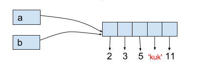

Pokračovanie č. IV

> ## Rezy
Keď sme v znakovom reťazci potrebovali zmeniť nejaký znak, zakaždým sme museli vyrobiť kópiu reťazca, napríklad:
~~~
retazec = 'Monty Python'
retazec[4] = 'X'     # takto sa to nedá
 
    ...
    TypeError: 'str' object does not support item assignment

retazec = retazec[:4] + 'X' + retazec[5:]
retazec

    'MontX Python'
~~~
Využili sme tu rezy (slice), t.j. získavanie podreťazcov. To isté sa dá použiť aj pri práci so zoznamami, lebo aj s nimi fungujú rezy, napríklad:
~~~
jazyky = ['Python', 'Pascal', 'C++', 'Java', 'C#']
print(jazyky)
    ['Python', 'Pascal', 'C++', 'Java', 'C#']

print(jazyky[1:3])
    ['Pascal', 'C++']

print(jazyky[-3:])
    ['C++', 'Java', 'C#']

print(jazyky[:-1])
    ['Python', 'Pascal', 'C++', 'Java']
~~~
Samozrejme, že pritom funguje aj určovanie kroku, napríklad:
~~~
print(jazyky[1::2])
    ['Pascal', 'Java']

print(jazyky[::-1])
    ['C#', 'Java', 'C++', 'Pascal', 'Python']
~~~
> #### Rezy **nemenia obsah** samotného zoznamu a preto hovoríme, že sú **immutable**.

> ### ***Priraďovanie do rezu***
Keď iba vyberáme nejaký podzoznam pomocou rezu, napríklad zoznam[od:do:krok], takáto operácia s pôvodným zoznamom nič nerobí (len vyrobí úplne nový zoznam). Lenže my môžeme obsah zoznamu meniť aj takým spôsobom, že **zmeníme len nejakú časť zoznamu**.

Takže **rez zoznamu** môže byť ***na ľavej strane*** priraďovacieho príkazu a potom ***na pravej strane*** priraďovacieho príkazu musí byť **nejaká postupnosť** (nemusí to byť zoznam). 

Priraďovací príkaz teraz túto postupnosť prejde, zostrojí z nej zoznam a ten vloží namiesto udaného rezu.

Príklady priraďovania rezu v ktorých sa modifikuje pôvodný zoznam, teda priraďovanie do rezu je **mutable** operácia.:
~~~
zoz = list(range(0, 110, 10))
print(zoz)
    [0, 10, 20, 30, 40, 50, 60, 70, 80, 90, 100]

zoz[3:6] = ['begin', 'end']   # tri prvky sa nahradili dvomi
print(zoz)
    [0, 10, 20, 'begin', 'end', 60, 70, 80, 90, 100]
~~~
~~~
zoz[6:7] = [111, 222, 333]   # jeden prvok sa nahradil tromi
print(zoz)
    [0, 10, 20, 'begin', 'end', 60, 111, 222, 333, 80, 90, 100]
~~~
~~~
abc = list('Python')
print(abc)
    ['P', 'y', 't', 'h', 'o', 'n']

print(abc[2:2])              # rez dĺžky 0
    []

print(abc[2:2] = ['dve', 'slova'])  # rez dĺžky 0 sa nahradí dvomi prvkami

print(abc)
    ['P', 'y', 'dve', 'slova', 't', 'h', 'o', 'n']
~~~
~~~
prvo = [2, 3, 5, 7, 11]
print(prvo[1:-1])
    [3, 5, 7]

prvo[1:-1] = []           # rez dĺžky 3 sa nahradí žiadnymi prvkami
print(prvo)                      # prvky sa takto vyhodili
    [2, 11]
~~~

> ## Porovnávanie zoznamov
Zoznamy môžeme navzájom **porovnávať (na rovnosť, alebo menší/väčší)**. Funguje to na rovnakom princípe ako porovnávanie znakových reťazcov:

* postupne sa prechádzajú prvky jedného aj druhého zoznamu, kým sú rovnaké

* ak je jeden so zoznamov kratší, tak ten sa považuje za menší ako ten druhý

* ak pri postupnom porovnávaní prvkov nájde rôzne hodnoty, výsledok porovnania týchto dvoch rôznych hodnôt je výsledkom porovnania celých zoznamov

* každé dva porovnávané prvky musí Python vedieť porovnať: na rovnosť je to bez problémov, ale **relačné operácie < a > nebudú fungovať** napríklad pre porovnávanie čísel a reťazcov

~~~
[1, 2, 5, 3, 4] > [1, 2, 4, 8, 1000]
    True

[1000, 2000, 3000] < [1000, 2000, 3000, 0, 0]
    True

[1, 'ahoj'] == ['ahoj', 1]
    False

[1, 'ahoj'] < ['ahoj', 1]
    ...
    TypeError: '<' not supported between instances of 'int' and 'str'
~~~
> ## Dve premenné referencujú (odkazujú) na ten istý zoznam
Už sme získali predstavu o tom, že priradenie zoznamu do premennej označuje, že sme v skutočnosti do premennej priradili referenciu na zoznam. Lenže na ten istý zoznam v pamäti môžeme mať viac referencií, napríklad:
~~~
a = [2, 3, 5, 7, 11]
b = a
b[3] = 'kuk'
print(a)
    [2, 3, 5, 'kuk', 11]
~~~
Menili sme obsah premennej **b** (zmenili sme jej prvok s indexom 3), ale tým sa zmenil aj obsah premennej **a**. Totiž obe premenné referencujú na ten istý zoznam:

Keď teraz meníme obsah premennej **b** ( ale len **pomocou mutable operácií !** ), zmení sa aj obsah premennej a:

> ## Nasleduje časť ktorá sa zaoberá :

* Zoznam ako parameter funkcie
* Metódy nad zoznamom
* Zoznam ako výsledok funkcie
  
Ktorými sa budeme zaoberať neskôr keď budeme preberať funkcie a metódy https://python.input.sk/z/08.html#zoznamy 

[Zhrnutie](16_Zoznamy_Zhrnutie.md)
