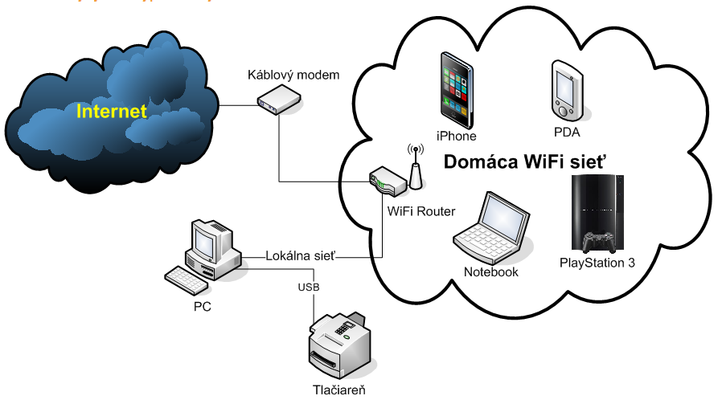
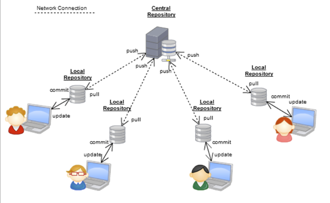
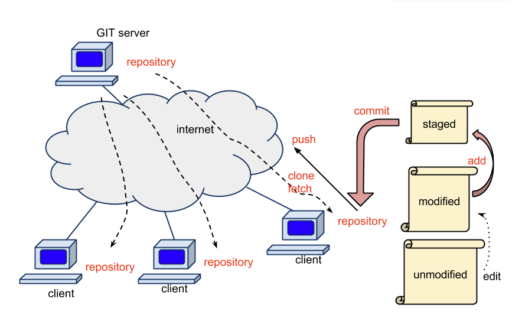
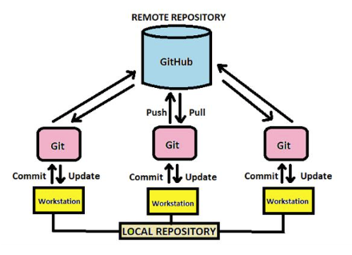
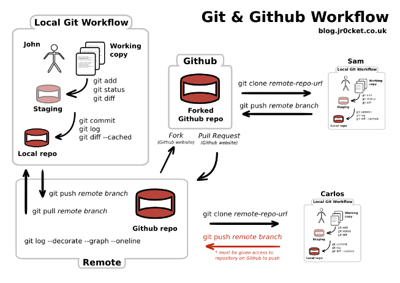

Vzhľadom k tomu v rámci predmetov "Aplikovaná informatika" a "Odborná pra" bude prebiehať výuka v terminálovej učebni budeme pracovať v nasledovnej štruktúre počítačovej siete.

Naviac či už vpriestoroch školy, na ulici alebo po príchode domov budeme účastníkmi novej počítačovej siete ktorej Štruktúra môže vyzerať napr. takto:

alebo takto:

My si však nechceme robiť poznámky a všetko sa chceme naučiť na hodine, aby sme zvyšný čas mohli venovať tréningu a športovej príprave ! Niektorí aj neustálemu hraniu počítačových hier, sledovaniu príspevkov na socialnych sieťah a filmových videi.
Na druhej strane keď už pojde do tuhého a konečne si najdeme aj trochu času pre individuálne štúdium budeme potrebovať prístup k študijným materiálom a priestor kam budeme môct ukladať vypracovanie našich úloh. 

A to je dôvod k tomu aby sme do našej prípravy zabudovali prácu s archivačným systémom, ktorý námnaviac umožní aj preberanie pracovných podkladov a spravovanie verzii našich vyplodov. Pre tieto účeli si zolime programou aplikaciu Gir resp. GitHub ktorá bude akousi nadstavbou alebo prekrytím vyšsie zobrazených počítačových štruktúr. 

Pri ich inštalácii máme ako študenti a pracovníci školstva možnosť bezplatne využiť aj licencované verzie, avšak nie je to podmienkou a nutnosťou. Tieto verzie obsahujú mnasledovne rozšírenia:

Implemntácia archivačného a VCS (Version Control Systems) systému dopĺňa iba softwareovú časť našej siete a zapája ju týmto súčasne do siete celosvetovej ako je to vidieť na tomto obrázku: 

Práca v tejto sieti sa dá názorne zobraziť aj takto":

Predmetom tejto časti bude okrem inštalácie a nastavéní týchto programových prostriedkov aj zoznámenie sa ako s nimi pracovať aby sme vedeli uskutočňovať naše zámery. Na tomto mieste si jednotlivé činnosti iba názorne predstavíme a v ďalšom sa im budeme venovať podrobnejšie.

