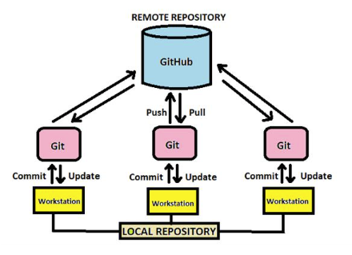

> *[Preco Git a GitHub](./Tahaky_dokumenty_obrazky/Git_GitHub/Preco_git.md)*

A to je dôvod k tomu aby sme do našej prípravy zabudovali prácu s archivačným systémom, ktorý námnaviac umožní aj preberanie pracovných podkladov a spravovanie verzii našich vyplodov. Pre tieto účeli si zolime programou aplikaciu Gir resp. GitHub ktorá bude akousi nadstavbou alebo prekrytím vyšsie zobrazených počítačových štruktúr. 

Implemntácia archivačného a VCS (Version Control Systems) systému dopĺňa iba softwareovú časť našej siete a zapája ju týmto súčasne do siete celosvetovej ako je to vidieť na tomto obrázku: 

Práca v tejto sieti sa dá názorne zobraziť aj takto":

Predmetom tejto časti bude okrem inštalácie a nastavéní týchto programových prostriedkov aj zoznámenie sa ako s nimi pracovať aby sme vedeli uskutočňovať naše zámery. Na tomto mieste si jednotlivé činnosti iba názorne predstavíme a v ďalšom sa im budeme venovať podrobnejšie.

> *[Príprava a používanie Git-u a GitHub-](./Tahaky_dokumenty_obrazky/Git_GitHub/Priprava_pouzivanie_git.md)*

[Kompletný návod Git a GitHub-u v slovenčine](./Tahaky_dokumenty_obrazky/Archivácia_suborov_a_VCS.pdf)

>*Základné otázky ktoré sú predmetom práce s Git a GitHub-om:*

[1.Čo znamenajú Git a GitHub úložiská?](./Tahaky_dokumenty_obrazky/Git_navod/Git_01.md)\
2.Ako nainštalovať Git a GitHub?\
3.Scenár 1: Vytvorenie lokálneho úložiska ako prvého\
4.Ako vytvoriť lokálne úložisko?\
5.Ako odovzdať súbory do lokálneho úložiska?\
6.Ako vytvoriť vzdialené úložisko GitHub?\
7.Ako povedať Git-u o GitHub-e?\
8.Ako synchronizovať lokálne a vzdialené úložiská?\
9.Scenár 2: Vytvorenie vzdialeného úložiska ako prvého\
10.Ako klonovať úložisko?\
11.Zhrnutie záverom 

**Jednorázovo použité príkazy v Git Shell-i**
~~~
$ git init  # vytvorenei lokalneho repository
$ git remote add meno_aliasu-gh https://github.com/tokost/sss-trencin.git # priradenie prezyvky tzv. alias repu na GitHub-e
~~~

**Opakovane používané píkazy v Git Shell-i**
~~~
$ git status    # zistenie stavu suborov na Git-e
$ git add .     # oznacenie vsetkych suborov pre uchovu
$ git commit -m "Komentár čo sa urobilo, zmenilo atď."    # pre vlozenie suborov na lokalny Git
$ git remote    # zistenie existujucich aliasov na GitHub-e
$ git pull meno_aliasu-gh main # stiahnutie suborov z GitHub-u
$ git push meno_aliasu-gh main # vlozenie suborov na GitHub
~~~
