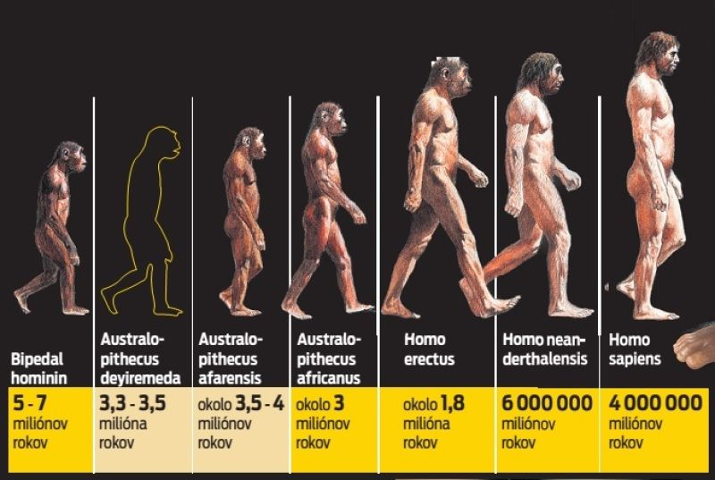
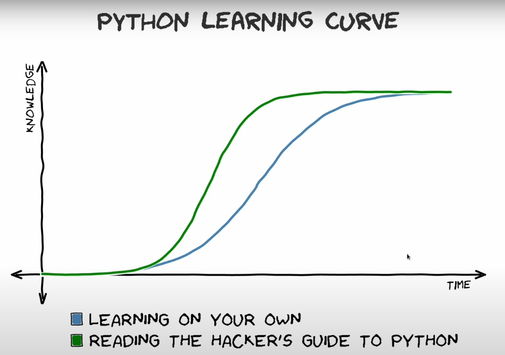
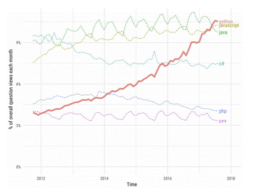

>## 1.	PREČO PROGRAMOVACÍ JAYZK PYTHON
a.	**aby** ste získali predstavu o tom čo to obnáša programovať a čo sa skrýva za každou z aplikácii ktoré denne niekoľko hodín používate

b.  **lebo** je to spôsob ako získať základné IT vedomie ktoré je v súčasnosti hybnou silou evolúcie ľudstva

c.	**lebo** je univerzálnym programovacím jazykom

d.	**lebo** má strmú krivku učenia sa a je velmi často používaným programovacím jazykom  

e.  **lebo** má implementované prvky umelej inteligencie ChatGPT, ktoré predstavujú budúcnosť programovania a vývojárských aktivít

f.	**lebo** na základe vyššie uvedeného je to zadané v učebných osnovách vášho študijného odboru

Celosvetovo uznávané zdroje tiež prinášajú celý rad presvedčivých dôkazov popularity a rozšírenosti Pythonu:
https://inspirezone.tech/why-python-is-popular-with-developers-2021/

**1.	Vyplýva to aj zo štatistík**

 ktoré hovoria jasnou rečou:

a.	**Index programátorskej komunity** TIOBE ktorý je meradlom popularity programovacieho jazyka na základe analýzy výsledkov z rôznych vyhľadávacích nástrojov ako Google a pod.

b.	**Index PYPL** ktorý je tiež index vytvorený analýzou vyhľadávaní. V porovnaní s TIOBE sa však PYPL zameriava iba na vyhľadávania z Google Trends.

c.	**Prieskum Stack Overflow** v ktorom sa Python objavil ako najžiadanejší programovací jazyk a javí sa aj ako tretí najobľúbenejší jazyk, čo naznačuje, že pravdepodobne ak začnete programovať resp. meniť jazyk bude to práve Python.

d.	**Prieskum GitHub** v ktorom sa Python umiestnil na druhom mieste ako jazyk, ktorý celkovo dominoval.
 Toto boli dôkazy prečo je Python populárny. Poďme sa v ďalšom pozrieť na dôvody, prečo je python populárny ako programovací jazyk.
 
 **2.	Python je super priateľský pre začiatočníkov**

a. Pravdepodobne kľúčovým dôvodom rastu popularity Pythonu je jeho nízka bariéra vstupu. **Syntax Pythonu je v porovnaní s inými jazykmi priamočiarejšia** na čítanie a zápis. Python je tiež predinštalovaný na systémoch Linux a v prípade potreby sa ľahko nastavuje a inštaluje.

b.	Ak sa jazyk **považuje za jednoduchší na učenie**, viac vývojárov bude pravdepodobne venovať čas jeho osvojeniu. Jednoduchosť Pythonu tiež znamená, že je skvelý pre začiatočníkov. Python je všeobecne považovaný za dobrú voľbu ako prvý programovací jazyk, ktorý sa treba naučiť.

c.	**Nízka bariéra vstupu** je určite jedným z hlavných dôvodov popularity Pythonu a prečo ho používa stále viac vývojárov.

**3.	Python je skutočne univerzálny**

a.	Programovací jazyk sa považuje za univerzálny, ak jeho použitie nie je obmedzené na konkrétny účel a vo všeobecnosti **možno ho použiť pre viac ako jeden typ softvérovej aplikácie**.

b.	Python je známy **svojim využitím pre mnoho rôznych typov softvérových aplikácií**. Niektoré z nich zahŕňajú strojové učenie, robotiku, automatizáciu, astronómiu, vývoj webových aplikácií, embeded systémy, programovanie IoT a mikrokontrolerov, spracovanie a analýzu údajov, spracovanie obrazu a vývoj hier. Pritom toto sú len niektoré z typov aplikácií, na ktoré možno použiť Python. Ak spomenieme aj akúkoľvek inú aplikáciu, na ktorá nám príde na um, tak je veľmi pravdepodobné, že existuje nejaký spôsob, ako ju vyvinúť pomocou Pythonu!

c.	**Dominanciu Pythonu ako programovacieho jazyka** možno vidieť aj v niekoľkých veľkých organizáciách, ktoré sa rozhodli používať Python na vývoj svojho popredného svetového softvéru. Podľa tohto článku je to napr. Google, Dropbox, Quora, Netflix, Facebook, Instagram, Spotify a Reddit ktoré používajú na svoj vývoj tiež Python.

**4.	Python je výkonný**

a.	**Štruktúra jazyka Python umožňuje jeho obrovskú rozšíriteľnosť** prostredníctvom modulov, knižníc a koncepcie framewokov.

b.	Python je výkonný preto, že keď je pri vývoji potrebné vynaložiť veľa tvrdej práce tak **zriedkakedy je potrebné začať vyvijať aplikáciu od začiatku**. Existuje totiž veľa implementácii Pythonu pre mnoho rôznych aplikácií, ktoré môžu programátori ihneď použiť pri vývoji svojho vlastného softvéru.

c.	Pokiaľ ide o mobilné telefóny platí tu presne výrok „ Veď na to už existuje aplikácia “, ktorú často stačí iba upraviť resp. doplniť. Doslova platí že **existuje implementácia Pythonu pre takmer každú aplikáciu**, na ktorú si spomeniete.

d.	**Rôznorodosť existujúcich aplikácii**. Chcete vo svojich aplikáciách používať rozpoznávanie obrázkov?  Pozrite si knižnicu OpenCV .  Chcete vykonať štatistickú analýzu údajov? Pozrite si knižnicu Numpy .  Chcete vytvoriť videohru?  Pozrite si modul Pygame . Chcete vytvoriť aplikáciu na zoškrabovanie resp. extrahovanie údajov z webovej stránky?  Pozrite si modul Selenium Python.

e.	Python už obsahuje moduly, knižnice alebo rámce, ktoré za vás urobia všetku náročnú implementáciu a v podstate vám **umožňuje vytvoriť vašu aplikáciu spojením stavebných blokov**.

f.	Poskytnutie **množstva existujúceho kódu** v Pythone pre mnoho rôznych typov aplikácií je určite solídnym dôvodom pre pokračujúci rast atraktívnosti Pythonu ako programovacieho jazyka.

**5.	Python má obrovskú podporu**

a existujú dve hlavné oblasti, ktoré ukazujú, ako je Python podporovaný vývojármi aj organizáciami.

a.	**Je to dokumentácia**. Python je známy ako dobre zdokumentovaný jazyk.  Dokumenty Python sú spoľahlivou referenciou pre oficiálnu dokumentáciu o vstavaných knižniciach a moduloch Pythonu. Moduly, knižnice a rámce tretích strán a vlastné moduly majú tiež tendenciu byť dobre zdokumentované prostredníctvom jedného alebo viacerých zdrojov. Ak jazyk nie je dobre zdokumentovaný, je nepravdepodobné, že bude populárny. Jedným z dôvodov, prečo zostal Python populárny, je dobre organizovaný a zdokumentovaný programovací jazyk.

b.	A **podpora od komunity** a vplyvných veľkých organizácii. Ako už bolo spomenuté, Python sa používa na vývoj mnohých softvérových aplikácií, ktoré vytvorili veľké nadnárodné organizácie. Výsledkom je, že jazyk Python získal rôzne úrovne podpory od samotných podporných organizácií, aby zostal relevantný. Pozrite si tento zoznam z python.org zobrazujúci niektorých priamych sponzorov a komunita Open source tiež podporuje Python. Táto vzorka frameworkov Djanjo , Flask a Tensorflow ktoré sú založené na Pythone je pravidelne udržiavaná komunitou open source.

