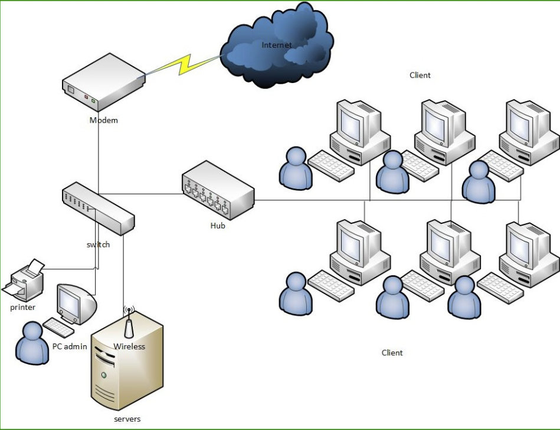
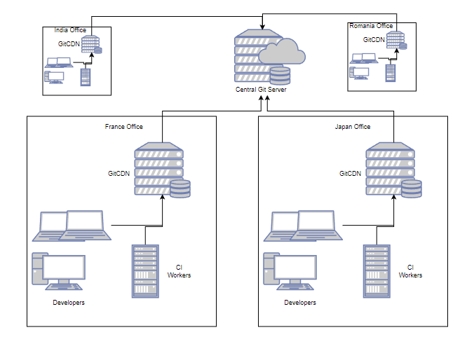
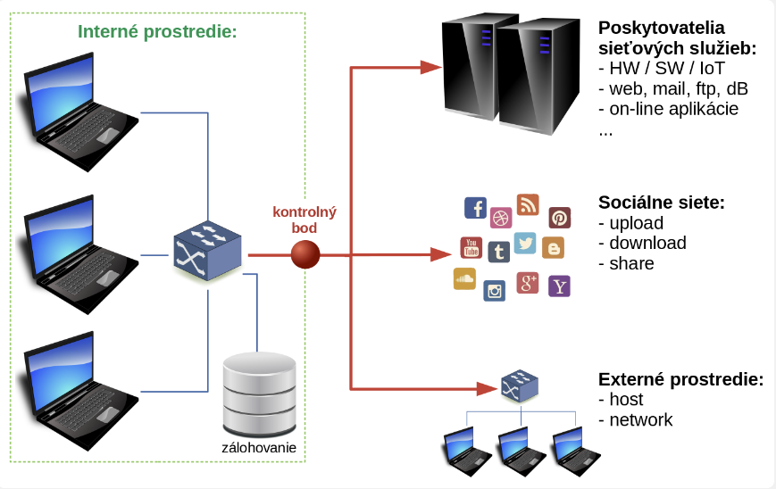

> ## PREČO Git a GitHub

Je to preto že predmety predmety "Aplikovaná informatika" a "Odborná prax" budú prebiehať v terminálovej učebni a ich výuka budeme intenzívne využívať jej technické a programové prostriedky. Naviac budeme pri výuke pracovať s veľkým množstvom učebných podkladov, pomocnej dokumentácie, odkazov, príkladov a pod. Pomocou nich budeme vytvárať naše vlastné dokumenty a súbory v ktorých si budeme individuálne precvičovať preberanú látku, vytvárať vlastné poznámky, skúšať alternatívne zápisy, riešiť individuálne a týmové úlohy a pod. Nuž a všetky tieto súbory, dokumenty, cvičenia a pod. si potrebujeme niekde a nejako uchovávať aby sme ich mali vždy podľa potreby k dispozícii pre použitie a mohli z nich čerpať inšpirácie pre naše riešenia. A to všetko nezávisle od toho v ktorej terminálovej učebni sa budeme nachádzať a pri ktorom zariadení budeme pracovať.

Obr. 1: Schéma HW prostriedkov LAN terminálovej učebne

Je to aj preto lebo z rôznych dôvodov sa nechceme obmedzovať iba na priesory a prostriedky školy, ale takýto prístup k uvedeným súborom a podkladom môže byť źiadaný aj po príchode domov, na internát či vo vlaku alebo na ulici. Vzniká teda potreba byť účastníkom novej počítačovej siete ktorej štruktúra môže vyzerať napr. takto:

Obr. 2: Oblastná počítačová sieť Wide Area Network (WAN) využivajúca výpočtové prostriedky rôzneho druhu

Implemntácia archivačného a VCS (Version Control Systems) systému predstavuje nadstavbu softwareového vybavenia siete alebo samostatných výpočtovách zariadení. Táto nadstavba nám umožní zapojiť sa aj do siete celosvetovej, čím okrem neobmedzeného prístupu a archivácie dát môžeme celosvetovo bezplatne využívať všetky jej služby tzv. GitCDN (**C**ontent **D**elivery **N**etwork) a získať [kontinuálnu integráciu](https://www.synopsys.com/glossary/what-is-cicd.html#:~:text=Continuous%20integration%20(CI)%20is%20practice,a%20reliable%20and%20repeatable%20way.) CI (**C**ontinuos **I**ntegration) všetkých jej účastníkov a kontinuálny prístup k ich dokumentom a súborom. 

Obr. 3: Celosvetová globálna internetová WAN 

Súčasťou tohoto vzájomného a neustáleho prepojenia ktoré je prístupné z ľubovolného miesta môžu byť okrem vývojových laboratórii, komerčných spoločností, škôl, domácich prostriedkov aj poskytovatelia sieťových služieb, sociálne siete a pod.

Obr. 3: Celosvetová internetová WAN s integráciou služieb a zdrojov

A v neposlednom rade je našim dôvodom pre to aby sme aj my používali tieto prostriedky a služby aj to že by sme neradi strácali čas nezáživnými a otravnými aktivitami ako je napr. písanie poznámok, alebo počúvanie monotónneho výkladu. Radšej by sme takýto čas využili efektívnejšie a to aktivitami ktoré pritiahnu našu pozornosť a budú mať okamžitý a hmatatelný efekt. Skrátka nám pojde o to aby sme sa všetko naučili na hodine, aby sme každou minútou získavali počítačovú prax ktorá je priamo spojená s programovanim a aby sme čas po škole mohli venovať tréningu, športovému zápoleniu, regenerácii, relaxácii a zábave ! V niektorých prípadoch aj neustálemu hraniu počítačových hier, sledovaniu príspevkov na socialnych sieťach, sledovaniu filmových videi a pod.

Na druhej strane treba si však tiež uvedomiť aj to, že raz príde čas, keď pojde do tuhého resp. bude potrebné si konečne najisť aj trochu času pre vypracovanie projektov, opakovanie látky a samoštúdium. Nuž a vtedy nám tiež Git s GitHub-om ponúka pomoc ako sa dostať k informačným zdrojom, podkladom, súborom v neobmedzenom čase a ľubovolného miesta.

[SPÄŤ](./../../03_Vytvorenie_archivacie_VCS_suborov.md)