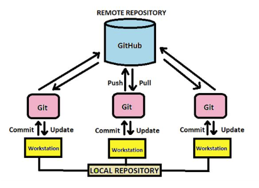
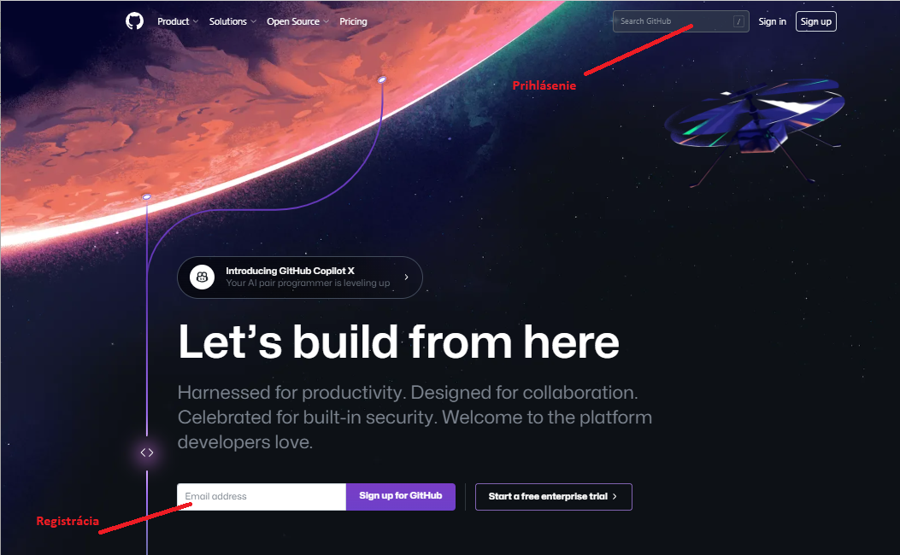

> ## Príprava a používania Git-u
Pri vytváraní a používaní lokálneho uložiska Git-u pre účely výuky je potrebné dodržiavať nasledovné pokyny:
* pokiaľ to nebude vykonané namapuje si adresár **//meno_servera/sss-ai** a označíme ho písmenom S: viď. [namapovanie adresára vo Win 10](https://support.microsoft.com/en-us/windows/map-a-network-drive-in-windows-29ce55d1-34e3-a7e2-4801-131475f9557d )  
* následne si každý pomocou suborového prehliadača na sieťovom disku v časti označenčenej **S:** vytvorí svoj vlastný pracovný adresár s názvom **priezvisko_meno-it_rocnik** na základe čoho by mala vzniknúť nasledovná cesta S:\priezvisko_meno-it_1 (resp. v git-e shell s/priezvisko_meno-it_1)
* do tohoto adresára sa nastavíme pomocou Git shellu vo VS-Code príkazmi :
~~~
    $ cd s:, $ cd oznacenie_disku:, $ cd meno_adresara , $ cd .. a pod.
~~~
* tu si vytvoríme svoj local repository (.git) pomocou príkazu **$ git init**
* spristupnenie tohoto adresara ktory môže mať ineho vlastnika vykonáme prikazom
  
    **$ git config --global --add safe.directory '%(prefix)///meno_servera/sss-ai/'**
* zmeníme názov vetvy master na main pomocou príkazu
 
  **$ git branch --move master main** 
  
  Zmena názvov vetiev [master vs. main](https://stevenmortimer.com/5-steps-to-change-github-default-branch-from-master-to-main/) sa týka zjednotenia používaného označenia v Git-e a GitHub-e. Viacej  o vetvách sa možno dozvedieť [tu](https://git-scm.com/book/en/v2/Git-Branching-Branch-Management
) 
* v osobnom adresari **priezvisko_meno-it** si pre každú hodinu vždy budeme  vytvárať podadresáre s poradovým číslom hodiny a označením ai. Celková cesta na takýto podadresár pre prvú hodinu potom bude vyzerať takto : s:\priezvisko_meno-it\01_ai (v git shell-e s/priezvisko_meno-it/01_ai)
* sem si budeme pre každú hodinu ukladať súbory ako z učiteľovho repository tak aj vlastného repository na GitHub-e (viď. nižšie) 
* a sem si vždy do príslušnej hodiny taktiež budeme lokalne ukladať všetky súbory s ktorými budeme na príslušnej hodine bude pracovať resp. si ich vytvárať. 
* presun z lokalneho adresára do lokalneho archívu (local repository) sa bude uskutočňoavť pomocou trojice príkazov : 
~~~
$ git status    # zistenie stavu suborov
$ git add .     # priprava suborov ktore maju byt ulozene do archivu 
$ git commit -m "komentar k ukladanym suborom"  # ulozenie suborov do archivu   
~~~

[Webová adresa inštalačného súboru Git](https://git-scm.com/)

Táto informácia je však určená pre individuálnu inštaláciu Git-u na súkromné zariadenia, nakoľko na školských zariadeniach je Git už nainštalovaný. Súbor z uvedenej stránky je potrebné si stiahnuť do určeného zariadenia a nasledne ho spustiť.

[Webová adresa pre vytvorenie účtu na GitHub-e](https://github.com/)

Pri vytváraní účtu na GitHub-e máme ako študenti a pracovníci školstva možnosť bezplatne využiť aj licencované verzie. To však nie je podmienkou a nutnosťou pre našu prácu a preto volíme možnosť "Continue for free". Na obrázku vidieť v čom sa líšia licencované verzie učtov a aké obsahujú rozšírenia:

> ## Príprava používania GitHub

Pri vytváraní vlastného účtu a repository na GitHub-e pre účely výuky je potrebné dodržať nasledovné pokyny:
* každý si vytvorí účet s nasledovným názvom **priezvisko_meno**
* každý si vytvorí vlastné úložsko s názvom **sss-it-priezvisko_meno**
* každý si v ňom na každú hodinu vytvorí podpriečinok s názvom poradového čisla hodiny a označenia predmetu (ai resp. op) **PoradoveCisloHodiny_ai**

> ## Príprava a používanie GitHub-u

Pri používaní vlastného účtu na GitHub-e pre účely výuky je potrebné dodržať nasledovné pokyny:
* vytvorenie alias-u $ git remote add sss-ai-gh https://github.com/tokost/sss-trencin.git 
* kontrola existujucich aliasov $ git remote
* stiahnutie s aliasom git pull sss-ai-gh main
* každý si ako prvé z repository na GitHub-e a adrese https://github.com/tokost/sss-trencin.git prejde do uložiska Vyuka/Aplikovana_informatika/PoradoveCisloHodiny stiahne všetky súbory príkazom **$ git pull vlastny_alias-gh main** do svojho pracovného adresára.
* každý si pred ukladaním súborov na GitHub zistí aké má vytvorené vlastné aliasy príkazom **$ git remote**
* každý si do tohoto podpriečinka pred skončením hodiny do tohoto podpriečinka uloží všetky svoje súbory s ktorými pracoval resp. kotoré vytvoril (príkazom **$ git push vlastny_alias-gh main**)
* každý si všetky nové súbory resp. stiahnuté súbory uloží aj do lokálneho uložiska ktoré si vytvoril podľa pokynov uvedených vyššie 

[SPÄŤ](./../../03_Vytvorenie_archivacie_VCS_suborov.md)

