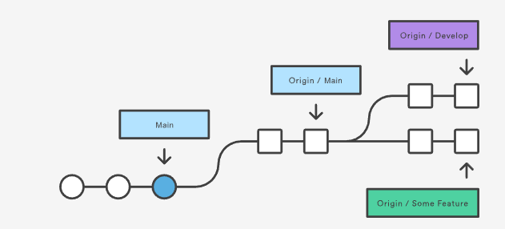
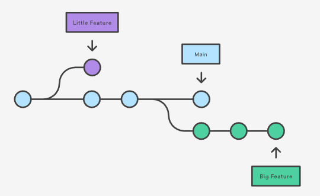
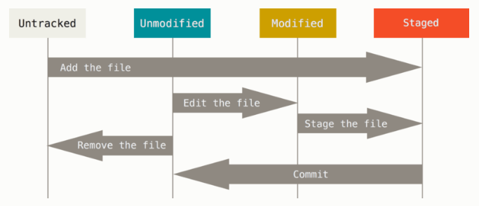

>## Vysvetlivky niektorých základných termínov

**git clone**\
git clone sa používa na vytvorenie kópie vzdialeného úložiska na vašom lokálnom počítači. Vytvorí nový adresár s rovnakým názvom ako vzdialené úložisko a skopíruje všetky súbory a históriu odovzdávania (commit-ov) do tohto adresára. Tento príkaz tiež automaticky nastaví diaľkový ovládač s názvom „origin“, ktorý ukazuje na pôvodné (originálne) úložisko, takže neskôr môžete jednoducho stiahnuť (pull-om)aktualizácie.

**git fetch**\
git fetch sa používa na získanie najnovších odovzdaní (commit-ov) zo vzdialeného úložiska, ale nevytvorí novú kópiu celého úložiska na vašom lokálnom počítači. Namiesto toho aktualizuje vašu lokálnu kópiu úložísk „vzdialené sledovanie vetiev (remote-tracking branches)“ (vetvy, ktoré sledujú stav vzdialených vetiev) bez úpravy vašich miestnych vetiev (branches). To znamená, že si zmeny môžete prezrieť pred ich zlúčením do miestnych vetiev (branches).

>Stručne povedané, **git clone** vytvorí úplnú kópiu vzdialeného úložiska na vašom lokálnom počítači, pričom **git fetch** načíta iba zmeny pričom vaše miestne vetvy (branch) zostanú nezmenené.

**git branch**\
git branches sú časové vetvy v ktorých sa zanamenávaju prostredníctvom línii a bodov zmeny v kóde či nejakom dokumente. Vetvy majú svoje pomenovanie a  dajú sa znazorniť stromovým diagramon. Posuv na ďalší bod vetvy nastáva vždy po commit-e. Vetvy nám umožnujú súčasne pracovať na rôznych verziach nášho kódu alebo súboru.

**master**\
je počiatočné (default) pomenovanie branch (vetvy) v Git-e. Vzniká napr. po stiahnutí súborov zo vzdialeného úložiska ako jediná predvolená takto pomenovaná lokálna vetva 

**main**\
je pomenovanie ktoré zaviedol GitHub iba premenovaním vetvy **master** pre akékoľvek úložisko. Toto meno je možné znovu zaviesť príkazom **$ git branch -m master main** Pri GitHub-e je main defaultným názvom vetvy a preto je dobré aby boli názvy Git-u a GitHub-u rovnaké.

**origin**\
v Git-e je origin skrátený názov vzdialeného úložiska z ktorého bol projekt pôvodne klonovaný. Používa sa namiesto URL adresy pôvodného úložiska aby bolo jednoduchšie odkazovanie sa na neho.

**staged**\
staged znamená, že ste označili upravený súbor v jeho aktuálnej verzii, aby ste ho pripravili pre odovzdanie (commit) ktorý vytvorí jeho novú verziu. 

**Unmodified**\
Unmodified znamená, že ste súbor nezmenili

**M - Modified**\
**M**odified znamená, že ste súbor zmenili, ale ešte ste ho neodoslali (commit) do svojho úložiska (local repository)

**U - Untraced**\
**U**ntraced sú nové súbory, ktoré boli vytvorené vo vašom pracovnom adresári, ale ešte neboli pridané do indexu sledovania úložiska pomocou príkazu git add. 

**commited**\
committed znamená, že údaje sú bezpečne uložené vo vašom lokálnom úložisku (local repository)

[SPÄŤ](./../../03_Vytvorenie_archivacie_VCS_suborov.md)