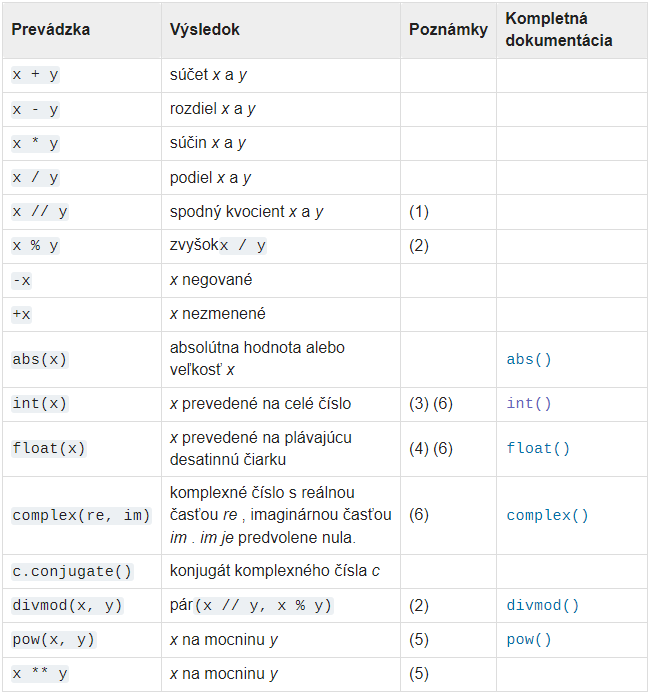

Na rozdiel od mnohých iných jazykov, ktoré sú kompilačné (napr. Pascal, C/C++, C#) je Python interpreter. To znamená, že interpreter nevytvára spustiteľný kód (napr. .exe súbor vo Windows)
na spustenie programu musí byť v počítači nainštalovaný Python interpreter umožňuje aj interaktívnu prácu s prostredím.
## Interaktívny režim¶
Po spustení IDE (Python GUI) - čo je vývojové prostredie (Integrated Development Environment), vidíme informáciu o verzii Pythonu a tiež riadok s tromi znakmi >>> (tzv. výzva, t.j. prompt). Za túto výzvu budeme písať príkazy pre Python.

Python 3.9.9 (tags/v3.9.9:ccb0e6a, Nov 15 2021, 18:08:50) [MSC v.1929 64 bit (AMD64)] on win32
Type "help", "copyright", "credits" or "license" for more information.

## Ako to funguje

Python je interpreter a pracuje v niekoľkých možných režimoch teraz sme ho spustili v príkazovom režime: očakáva zadávanie textových príkazov (do riadka za znaky >>>), každý zadaný príkaz vyhodnotí a vypíše prípadnú reakciu (alebo chybovú správu, ak sme zadali niečo nesprávne) po skončení vyhodnocovania riadka sa do ďalšieho riadka znovu vypíšu znaky >>> a očakáva sa opätovné zadávanie ďalšieho príkazu takémuto interaktívnemu oknu hovoríme shell niekedy sa môžete dočítať aj o tzv. REP cykle interprétra, znamená to Read, Evaluate, Print, teda prečítaj, potom tento zápis vyhodnoť a na koniec vypíš výsledok, toto celé stále opakuj.

Môžeme teda zadávať, napr. nejaké matematické výrazy
~~~
>>> 12345
12345
>>> 123 + 45.63  
168.63
>>> 1 * 2 * 3 * 4 * 5 * 6
720
>>> type(720)
<class 'int'>
~~~
V tomto príklade sme pracovali s celými číslami a niektorými celočíselnými operáciami. Python poskytuje niekoľko rôznych typov údajov; na začiatok sa zoznámime s tromi základnými typmi: celými číslami, desatinnými číslami, binárnymi čislami a bytami.

> **Celé čísla** (integer skratka int)
dátový typ celých čísel, ktorý teoreticky nemá limit na dĺžku hodnoty (limitom bude vždy systém, v ktorom sa pracuje). 
* majú rovnaký význam, ako ich poznáme z matematiky: zapisujú sa v desiatkovej sústave a môžu začínať znamienkom mínus
* ich veľkosť (počet cifier) je obmedzená len kapacitou pracovnej pamäte Pythonu (hoci aj niekoľko miliónov cifier)

Pracovať môžeme aj s desatinnými číslami (tzv. floating point). Python ich automaticky rozlišuje podľa existencie desatinnej bodky napr.
~~~
>>> 22 / 7
3.142857142857143
>>> .1 + .2 + .3 + .4
1.0
>>> 9999999999*99999999999
999999999890000000001
>>> 9999999999*99999999999.
9.9999999989e+20
>>> type(9.9999999989e+20)
<class 'float'>
~~~
Všimnite si, že 3. výraz 9999999999*99999999999 násobí dve celé čísla a aj výsledkom je celé číslo. Hneď ďalší výraz 9999999999*99999999999. obsahuje jedno desatinné číslo a teda aj výsledok je desatinné číslo.
>**Desatinné čísla** (float)
desatinné čísla sa píšu v Pythone s bodkou
~~~
>>> flt1 = 24.8
>>> flt2 = float(18 / 4)
>>> flt3 = 5.476e9
>>> print('flt1 =', flt1, 'flt2 =', flt2, 'flt3 =', flt3)
flt1 = 24.8 flt2 = 4.5 flt3 = 5476000000.0
~~~
* obsahujú desatinnú bodku alebo exponenciálnu časť (napr. 1e+15)
* môžu vzniknúť aj ako výsledok niektorých operácií (napr. delením dvoch celých čísel)
* majú obmedzenú presnosť (približne 16-17 platných cifier)
~~~
>>> float(2)                ①
2.0
>>> int(2.0)                ②
2
>>> int(2.5)                ③
2
>>> int(-2.5)               ④
-2
>>> 1.12345678901234567890  ⑤
1.1234567890123457
>>> type(1000000000000000)  ⑥
<class 'int'>
~~~
①	Volaním funkcie float() m;žeme explicitne vynutit prevod int (typ pre celé číslo) na float (typ pre reálné číslo).\
②	A nebude asi moc prekvapivé, že voláním int() môžeme vynútit prevod float na int.\
③	Funkcia int() nezaokrouhluje, ale odsekává.\
④	Funkcia int() odsekává desetinnú časť u záporných čísel smerom k nule. Ide o funkciu skutočného odsekávania, nie o funkciu floor (tj. u záporných čísel dojde k zväčšeniu čísla, pretože napríklad –2.5 se zmení na –2).\
⑤	Čísla typu float sú uložené s presnosťou na 15 desetinných miest.
⑥	Celé čísla môžu byťt ľubovolne velké.

> **Zlomky** (fraction)

ako napr. 0.75, 3/1 a 3/5. Tento datový však potrebuje použiť modul fractions z knižnice ktorý je potrebné pred použitím do programu resp. zápisu naimportovat
~~~
>>> from fractions import Fraction 
>>> Fraction(3)                    
Fraction(3, 1)
>>>print(Fraction(0.75))
3/4
>>> print(Fraction(3, 5))
3/5
~~~

> **Komplexné čísla** (complex)

Komplexný dátový typ v pythone pozostáva z dvoch hodnôt ktoré sú float, z ktorých prvá je reálna časť komplexného čísla a druhá je imaginárna časť komplexného čísla . Reálnu časť zvyčajne označujeme pomocou i a imaginárnu časť j. Napríklad (3 + 7j) alebo (3i + 7j). Tieto zložky sa dajú aj extrahovať z komplexného čísla napr.z použitím príkazov z.real a z.imag
'''
~~~
>>>3 + 0j
(3+0j)

>>>0 + 3j
3j

>>>2 + 3j + 4 + 5j
(6+8j)

>>>3 + 2j == 2j + 3
True

>>>z = 3 + 2
>>>type(z)     # prve pouzitie nejakej funkcie !!!
<class 'int'>    
~~~

~~~
>>>z = 3.14 + 2.71j
>>>type(z)
<class 'complex'>
~~~
~~~
>>> z = 3 + 7j        
>>> z.real 
3.0
>>> z.imag
7.0
~~~
~~~
>>> cmp1 = 4j
>>> cmp2 = 7 + 4j
>>> cmp3 = cmp1 + cmp2
>>> print('cmp1 =', cmp1, 'cmp2 =', cmp2, 'cmp3 =', cmp3) 
>>> cmp1 = 4j cmp2 = (7+4j) cmp3 = (7+8j)
~~~

https://docs.python.org/3/library/stdtypes.html 

Existujú tri odlišné typy čísel: celé čísla , čísla s pohyblivou rádovou čiarkou a komplexné čísla. Zatial čo celé čísla majú neobmedzenú presnosť. Čísla s pohyblivou rádovou čiarkou sú zvyčajne implementované pomocou označenia float a informácie o presnosti a internej reprezentácii čísel s pohyblivou rádovou čiarkou pre počítač, na ktorom beží váš program, sú dostupné pomocou príkazu sys.float_info takto
~~~
>>> import sys
>>> sys.float_info.dig
15
~~~
Čísla sa vytváraju pomocou číselných literalov resp. čislic alebo ako výsledok vstavaných funkcii a operátorov. Celé čísla vrátane hexadecimálnych, osmičkových a binárnych majú celočíselny tvar. Číselné literály obsahujúce desatinnú čiarku alebo exponent dávajú čísla s pohyblivou rádovou čiarkou. Pridaním 'j'alebo 'J'k číselnému literálu sa získa imaginárne číslo (komplexné číslo s nulovou reálnou časťou), ktoré môžete pridať k celému číslu alebo pohyblivej časti a získať tak komplexné číslo s reálnou a imaginárnou časťou. Python plne podporuje zmiešanú aritmetiku: keď má binárny aritmetický operátor operandy rôznych číselných typov, operand s „užším“ typom sa rozšíri na operand druhého, kde celé číslo je užšie ako s pohyblivou rádovou čiarkou, čo je užšie zase ako číslo komplexné. Porovnanie medzi číslami rôznych typov sa správa tak, ako keby sa porovnávali presné hodnoty týchto čísel. Na explicitné vytváranie čísiel špecifického typu sa používajú tzv. konštruktory int(čislo), float(číslo) a complex(číslo)
~~~
>>> int(5.55)
5
>>> float(555)
555.0
>>> complex(5+9)
(14+0j)
>>>
~~~
Všetky číselné typy (okrem komplexných) podporujú nasledujúce operácie :

Poznámky:

   1.&emsp; &nbsp;Označuje sa tiež ako celočíselné delenie. Výsledná hodnota je celé celé číslo, hoci typ výsledku nemusí byť nevyhnutne int. Výsledok je vždy zaokrúhlený smerom k mínus nekonečnu: 1//2 je 0, (-1)//2 je -1, 1//(-2)je -1, a (-1)//(-2) je 0.

2.&emsp; &nbsp;Nplatí pre komplexné čísla. Namiesto toho ak je to vhodné treba vykonť konverzia na float použitím funkcie abs().

3.&emsp; &nbsp;Konverzia z float na int skráti čislo, pričom sa zahodí zlomková časť.

4.&emsp; &nbsp;float tiež akceptuje reťazce „nan“ a „inf“ s voliteľnou predponou „+“ alebo „-“ pre Not a Number (NaN) a kladné alebo záporné nekonečno.

5.&emsp; &nbsp;Python definuje pow(0, 0) a 0**0 ze je 1 ako je to bežné pre programovacie jazyky.
6.&emsp; &nbsp;Akceptované číselné literály zahŕňajú číslice 0 až 9 alebo akýkoľvek ekvivalent Unicode https://sk.eferrit.com/co-je-unicode/ .

https://www.linode.com/docs/guides/how-to-use-unicode-in-python3/ 

## Bežné operácie s číslami
~~~
>>> 11 / 2      ①
5.5
>>> 11 // 2     ②
5
>>> −11 // 2    ③
−6
>>> 11.0 // 2   ④
5.0
>>> 11 ** 2     ⑤
121
>>> 11 % 2      ⑥
1
~~~
①	Operátor / vykonáva ďelenie. Vracia výsledok typu float dokonca i v prípade, že činitel aj menovateľ sú typu int.\
②	Operátor // vykonáva svojim spôsobom podivné celočíselné delenie. Keď je výsledok kladný, môžeme o ňom uvažovať, že vznikol odseknutím desetinných miest (teda nie zaokruhlením). Ale pozor na to.\
③	Pri celočíselnom delení záporných čísiel vykoná operátor // zaokruhlenie „nahor“ k najbližšiemu celému číslu. Z matematického hľadiska zaokrouhluje „dole“, pretože −6 je menšie než −5. Ale pokiaľ by ste očakávali, že dôjde k odseknutiu na −5, tak by ste se nachytali.\
④	Operátor // nevracia celé číslo vždy. Pokiaľ je čitatel alebo menovateľ typu float, bude výsledok síce opäť zaokrúhlený na celé číslo, ale výsledná hodnota bude typu float.
⑤	Operátor ** znamená „umocnené na“. napr. 11 na 2 je 121.\
⑥	Operátor % vracia zvyšok po celočíselnom delení. Napr. 11 deleno 2 je 5 a zvyšok je 1. Takže výsledkom bude 1.

Operácie využívajú operandy a operátory. Operandami sú premenné/čísla a operátormi znamienka, napríklad + alebo -. Na vykonávanie operácií používame operátory. K tým aritmetickým ako vidieť v tabuľe patria napr.
~~~
+, -, *, /, ale aj modul %, exponent ** a delenie bez zvyšku //
~~~
~~~
>>> a, b = 6, 3
>>> c = a + b
>>> print("a + b =", c)
9  # je vysledok
>>> c = a - b
>>> print('a - b =', c) 
3  # je vysledok
>>> c = a * b
>>> print('a * b =', c)
18  # je vysledok
>>> c = a / b
>>> print('a / b =', c)
2.0  # je vysledok
~~~
~~~
a, b = 17, 9
c = a % b
print('a % b =', c) # 8
c = a**2 + b**2
print('a**2 + b**2 =', c) # 370
c = a // b
print('a // b =', c) # 1
~~~
Ak sa pri operáciách operátor nachádza medzi svojimi operandami hovoríme i tzv. **infixovom zápise**. Hovoríme o tom preto lebo pri programovaní sa často používa zápis, kedy sa operátor vkladá pred operandy. Vtedy hovoríme o tzv. **prefixovom zápise**. Pre úplnosť treba spomenú že ešte sa možeme stretnúť s tzv. **postfixovým zápisom** kedy sa operátor vkladá za operandy. Názorne to môžeme vidieť v nasledujúcej tabuľke:

~~~
>>> x=0
>>> x=x+1   # priklad infixoveho zapisu
>>> print(x)
1
>>> x+=1    # priklad prefixoveho zapisu
>>> print(x)
2
~~~

> ## Zhrnutie
Celé čísla môžeme zapisovať v rôznych číselných sústavách:
**binárna sústava (dvojková)** – pred čísla dávame 
predponu 0b (0B) – print(0b15)
~~~
>>> bin1 = bin(43)
>>> bin2 = 0b10110110
>>> bin3 = 14
>>> print('bin1 =', bin1, 'bin2 =', bin2, 'bin3 =', bin(bin3)[2:]) 
bin1 = 0b101011 bin2 = 182 bin3 = 1110
~~~
**decimálna sústava (desiatková)** – print(15)
~~~
>>> dec1 = 18
>>> dec2 = int(67)
>>> print('dec1 =', dec1, 'dec2 =', dec2) 
dec1 = 18 dec2 = 67
>>> print(type(dec1))   # zobrazenie datoveho typu
<class 'int'>
~~~
**oktálna sústava (osmičková)** – pred čísla dávame predponu 0o (0O) – print(0o15)
~~~
>>> okt1 = 0o24
>>> okt2 = 24
>>> okt3 = oct(10)
>>> print('okt1 =', okt1, 'okt2 =', oct(okt2), 'okt3 =', okt3) 
okt1 = 20 okt2 = 0o30 okt3 = 0o12
~~~
**hexadecimálna sústava (šestnástková)** – pred čísla dávame predponu 0x (0X) – print(0x15)
~~~
>>> hex1 = 0x142
>>> hex2 = 16
>>> hex3 = hex(32)
>>> print('hex1 =', hex1, 'hex2 =', hex2, 'hex3 =', hex3)
hex1 = 322 hex2 = 16 hex3 = 0x20
~~~