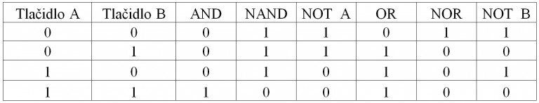
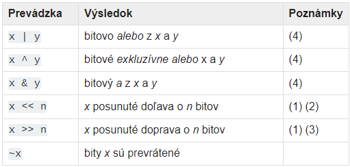

# Dátový binárne čísla a operácie s nimi
Binárne čisla sú podtypom celých čísel a preto aj bitové operácie majú zmysel len pre celé čísla. Binárne čisla predstavujú kombináciu nul a jednotiek pričom prvý bit je vnímaný ako znamienkový (1 sa rovna - a 0 sa rovná +). Vznikajú prevodom na základe dohodnutého kódu a je k tomu možné použiť aj rôzne internetovské konvertory.
https://www.justfreetools.com/sk/decimal-to-binary-converter 
 Binárne čísla majú výnimočné postavenie najmä v automatizačnej technike a na tejto báze pracuje nie len kodovanie desiatkových čísiel, ale aj textových, grafikých, zvukových a video informácii do tvaru ktorému počitač rozumie a s ktorým vie pracovať.
 https://sk.wikipedia.org/wiki/UTF-8 
https://www.youtube.com/watch?v=Dkh0nFoEwLs 

 http://www.spslevice.sk/ucebnice/SOC/SOC%20-%20PRI/66-Zakladne_logicke_funkcie.htm 
 
 Medzi binárnimi číslami platia nie len aritmetické operácie (+, -, *, / atď. ) ale aj tzv. operácie logické. Výsledok logických operácií dvoch čísiel ktoré sú vyjadrené v binárnom tvare potom závisí od použitej logickej funkcie:

https://portal.matematickabiologie.cz/index.php?pg=zaklady-informatiky-pro-biology--teoreticke-zaklady-informatiky--teorie-cisel--dvojkovy-doplnek 

https://data.kemt.fei.tuke.sk/Architektury_pocitacovych_systemov/_materialy/prednasky/aritmetika_opakovanie.pdf 

https://www.justfreetools.com/sk/decimal-to-binary-converter 

https://www.youtube.com/watch?v=YIig2e_kJxc 

https://senzor.robotika.sk/sensorwiki/index.php/Aritmetick%C3%A9_oper%C3%A1cie_v_dvojkovej_s%C3%BAstave 

Všetky priority binárnych bitových operácií sú nižšie ako numerické operácie a vyššie ako operácie porovnania; avšak jednočlenná operácia ~ má rovnakú prioritu ako ostatné jednočlenné číselné operácie ( + a -).

V tejto tabuľke sú uvedené operátory ktoré sa používajú v Pythone pre jednotlivé logické funkcie zoradené podľa vzostupnej priority:

Poznámky:

1.&emsp; &nbsp;Posuny do záporných čísiel nie sú povolené a spôsobujú ValueError zvýšenie a.

2.&emsp; &nbsp;Posun doľava o n bitov je ekvivalentný násobeniu číslom a zodpovedá zápisu pow(2, n)

3.&emsp; &nbsp;Posun doprava o n bitov je ekvivalentný celočíselnému deleniu // a zodpovedá zápisu pow(2, n)

4.&emsp; &nbsp;Uskutočnenie týchto výpočtov môže byť vykonávané aj s jedným znamienkovým bitom nachádzajúcim sa na ľavom kraji binárneho kódu reprezentujúceho desiatkové čislo.
~~~
# Pri vypocte pouzime zapis bin(z)[2:] ktory najprv vykona zakodovanie cislice do binarneho tvaru bin(z) apotom odreze prve dva znaky [2:] tzv. slice notation t.j. oznacenie 0b aby zostala iba vlastna hodnota vysledku

>>> x = 10  # 0b1010
>>> y = 14  # 0b1110

# and(&) - 1 ak bude na bitovom mieste oboch  premenných 1
>>> z = x & y
>>> print('x & y =', bin(z)[2:])
x & y = 1010

# or(|) - 1 ak na bitovom mieste je aspoň jedna hodnota 1
>>> z = x | y
>>> print('x | y =', bin(z)[2:])
x | y = 1110

# xor(^) - 1 ak bude na bitovom mieste presne jedenkrát 1
>>> z = x ^ y
>>> print('x ^ y =', bin(z)[2:])
x ^ y = 100

# komplement(~) - prevod každej 1 na 0 a opačne
>>> z = ~x
>>> print('~x =', bin(z))
~x = -0b1011

# binárny posun vľavo(<<) - posun bitov o určitý počet miest vľavo (číslo sa zväčší)
>>> z = x << 2
>>> print('x << 2 =', bin(z)[2:])
x << 2 = 101000

# vpravo(>>) - posun bitov o určitý počet miest vpravo (číslo sa zmenší)
>>> z = x >> 2
>>> print('x >> 2 = ', bin(z)[2:])
x >> 2 =  10
~~~

~~~
>>> n=-37   # zadané záporné číslo v desiatkovom tvare
>>> bin(n)  # jeho binárne vyjadrenie pomocou funkcie bin()
'-0b100101' # jeho binárne vyjadrenie pomocou funkcie bin()
>>> n.bit_length() # zistenie počtu bitov čísla bez znamienka
6
>>>
~~~

https://docs.python.org/3/library/stdtypes.html#bitwise-operations-on-integer-types

V pythone sa tiež použiva kľúčové slovo **None** na definovanie nulovej resp. žiadnej hodnoty. None však nie je to isté ako 0, False alebo prázdny reťazec " ". None je vlastný datový typ (NoneType) a iba None môže byť None
~~~
>>> x = None    # priradime hodnotu None premennej x
>>> print(x)    # zobrazíme aká hodnota je označená ako x
>>> print(type(x))  # zobrazíme datový typ premennej x
~~~

~~~
>>> x=9
>>> bin(x)
'0b1001'
>>> y=10
>>> bin(y)
'0b1010'
>>> print(x&y)
8
>>> bin(x&y)
'0b1000'
~~~
https://sk.from-locals.com/python-bit-operation/
https://sk.from-locals.com/python-bin-oct-hex-int/ 
~~~
>>> print(bin(13))
0b1101
>>> print(bin(6))  
0b110
>>> result=0b1101+0b110
>>> print(result)
19
>>> print(bin(result)) 
0b10011
>>> print(format(0b10011))
19
>>>
~~~

~~~
>>> print(bin(13))
0b1101
>>> print(bin(-6))
-0b110
>>> odcitanie=0b1101+(-0b110)
>>> print(odcitanie)
7
>>> print(bin(odcitanie))
0b111
>>>
~~~

~~~
>>> print(bin(13))
0b1101
>>> print(bin(6))
0b110
>>> rozdiel=0b1101-0b110
>>> print(bin(rozdiel))
0b111
>>> print(format(rozdiel))
7
>>>
~~~
~~~
>>> zaporny_rozdiel=0b110-0b1101
>>> print(bin(zaporny_rozdiel)) 
-0b111
>>> print(format(zaporny_rozdiel)) 
-7
>>>
~~~

## Bajty (byt) a bajtové polia
Kombinácia 8-ich binárných číslic nám vytvára byt.
> **1 byt = 8 bitov**&emsp; &nbsp; napr. 1B=1001 1110

Súbor viacerých bytov vytvorí pole bajtov a táto štruktúra môže napr. reprezentovať obrázok vo formáte jpeg alebo inom formáte.

https://www.gpnr.sk/obsah/predmety/subory/informatika/K%C3%B3dovanie_r%C3%B4znych_typov_inform%C3%A1ci%C3%AD.pdf 

https://winpcguide.ru/sk/computer-literacy/the-formats-of-graphic-files-are-formats-of-storage-of-graphic-data/ 

>## Logické operácie
Pozrime sa podrobnejšie na logické operácie and, or a not. Tieto operácie samozrejme fungujú pre logické hodnoty True a False.

Logický súčin a súčasne:

A	B	A and B
False	False	False
True	False	False
False	True	False
True	True	True
Logický súčet alebo:

A	B	A or B
False	False	False
True	False	True
False	True	True
True	True	True

Negácia:

A	not A
False	True
True	False

Logické operácie fungujú nielen pre logický typ ale aj pre skoro všetky ďalšie typy. V tomto prípade Python pre každý typ definuje prípady, ktoré sa chápu ako False a tým je aj určené, že všetky ďalšie hodnoty tohto typu sa chápu ako True. Ukážme prípady pre doteraz známe typy, ktoré označujú logickú hodnotu False:

typ	False	True
int	x == 0	x != 0
float	x == 0.0	x != 0.0
str	x == ''	x != ''

