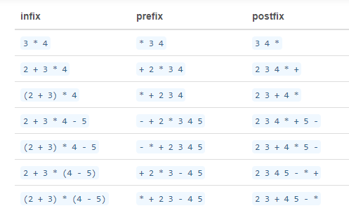

Ak sa pri operáciách operátor nachádza medzi svojimi operandami hovoríme i tzv. **infixovom zápise**. Hovoríme o tom preto lebo pri programovaní sa často používa zápis, kedy sa operátor vkladá pred operandy. Vtedy hovoríme o tzv. **prefixovom zápise**. Pre úplnosť treba spomenú že ešte sa možeme stretnúť s tzv. **postfixovým zápisom** kedy sa operátor vkladá za operandy. Názorne to môžeme vidieť v nasledujúcej tabuľke:

~~~
>>> x=0
>>> x=x+1   # priklad infixoveho zapisu
>>> print(x)
1
>>> x+=1    # priklad prefixoveho zapisu
>>> print(x)
2
~~~