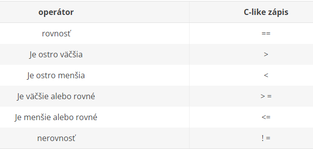

# Dátový typ boolean a operácie s nimi
Boolean alebo booleovské hodnoty predstavujú v informatike datový typ ktorý je určený pre reprezentáciu pravdivostních hodnôt t.j. pravda (True) a nepravda (False). Celé si to možno predstaviť ako žiarovku. Buď žiarovka svieti, alebo nesvieti. Iná možnosť nie je.  Vyhodnocovaním týchto dvoch hodnôt v príkaze (napr. if) alebo v ľubovolnom výraze sa zvyčajne riadi tok programu. **Pokiaľ sa výraz vyhodnocuje** ako pravda urob toto, inak urob niečo iné. **Python sa pokúša získať jeho pravdivostnú hodnotu**. Pravidlá, podľa ktorých se v booleovskom kontexte výsledok chápe ako pravdivý alebo nepravdivý (true alebo false), sú pre rôzne datové typy rôzne. Túto skutočnosť však lepšie pochopíme na konkrétnych príkladoch nižšie. Pre **priame priradenie booleovských hodnôt** sa tiež definujú iba tieto dve konštanty True a False. V Pythone sa ako pravdivý výraz True vyhodnotí nenulové číslo, neprázdny reťazec (alebo iný neprázdny dátový typ). 
~~~
>>> size = 1
>>> size < 0
False
>>> size = 0
>>> size < 0
False
>>> size = -1
>>> size < 0
True
~~~
S booleovskými hodnotami sa môže zachádzať aj ako s číslami. Ak True je 1 a False je 0 tak :
~~~
>>> True + True
2
>>> True - False
1
>>> True * False
0
>>> True / False    # nam vrati chybu
~~~

Boolean daného typu zistíme pomocou funkcie bool().

~~~
>>> bool(1)
True
>>> bool(3.14)
True
>>> bool("Ahoj!")
True
>>> bool(0)
False
>>> bool("")
False
>>>
~~~
## Operátory porovnávania 

Tu je niekoľko príkladov použitia týchto operátorov:
~~~
>>> 1 == 1
True
>>> 3 > 2
True
>>> 3 < 2
False
>>> 5 >= 4
True
>>> 5 <= 4
False
>>> 6 >= 6
True
>>> 1 != 2
True
~~~

V Pythone sa negácie boolovských hodnôt vykonáva operátorom **not** . Python má tiež operátory porovnávania **is,is not, in** a **not in**.

> **is** 

Operátor **is** môžno použiť na porovnávanie dvoch čísiel, toho istého objektu predstavujúce celé číslo a viaceré čísla, ale **neporovnávajte týmto operátorom dva objekty**. Python totiž porovná či obe premenné odkazujú na rovnaký objekt a hoci môžu mať premenné rovnakú hodnotu, tak nemusí byť zabezpečené odkazovanie na rovnaký objekt t.j. s rovnakým identifikačným číslo. Len pre úplnosť - ID objektu (jeho identifikačné číslo) sa dá zistiť pomocou funkcie **id()**. Operátor **is not** vracia opačnú hodnotu, než operátor **is**.

> **in** 

Operátor **in** zisťuje, či je reťazec obsiahnutý v inom reťazci (a to že túto operáciu možno použiť aj s inými dátovými typy ako sú reťazce si ukážeme neskôr).
Operátor **not in** robí pravý opak.
~~~
>>> "a" in "abeceda"
True
>>> "b" in "python"
False
>>> "a" not in "python"
True
>>> "b" not in "abeceda"
False
~~~

> ### Pozor pri niektorych konstrukciach ako je použitie napr. if treba nasledujuci riadok odsadzovat pomocou tabulatora a na konci davat dvojbodku : !!! ###

~~~
>>> x, y, z = 24, 17, 14
>>> if x == y:
>>>    print('x je rovné y')
>>> print('x nie je rovné y lebo x =', x,'a y =',y)
x nie je rovné y lebo x = 24  a y = 17    # vysledok
>>> print(type(x))
<class 'int'>
>>> print(type(y))
>>> print(type(x == y))
<class 'bool'>

if x != z:
   print('x je rozdielne od z')

if x > z:
   print('x je väčšie ako z')

if x < y:
    print('x je menšie ako y')

if z >= y:
    print('z je väčšie alebo rovné y')
elif z <= y:
    print('z je menšie alebo rovné y')
~~~