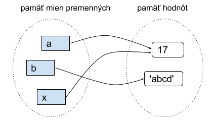
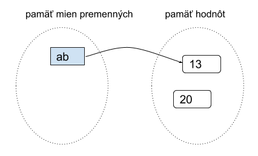
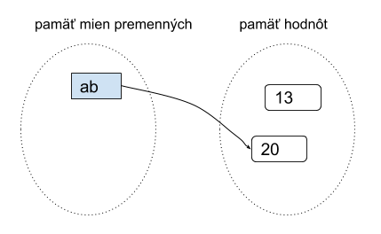

# Premenné a operácie s premennými
O premenným môžeme hovoriť ako o rezervovaní miesta v pamäti na ukladanie hodnôt. 
* premenná sa vytvorí priraďovacím príkazom (ak ešte doteraz neexistovala). Hodnoty sa teda pripisujú pomocou „=“, kde na ľavej strane sa nachádza názov premennej a napravo hodnota ktorú jej priraďuejme:
>zapisujeme to :&emsp; &nbsp; **premenná = hodnota**

tento zápis znamená, že do ***premennej*** sa má priradiť zadaná ***hodnota***

Deklarovaním premennej určíme jej názov a dátový typ (platí to aj pre iné programovacie jazyky). Takejto premennej sa vyhradí miesto v pamäti spolu s hodnotou, ak ju určíme.
* v skutočnosti sa však na rozdiel od iných programovacích jazykov v Pythone do premennej priradí iba **referencia (odkaz)** na danú hodnotu (a nie samotná hodnota)
* ďalšie priradenie do tej istej premennej zmení túto referenciu
* na tú istú hodnotu sa môže odkazovať aj viac premenných
* meno môže referencovať (mať priradenú) maximálne jednu hodnotu
* 

Každá hodnota v Pythonu je určitého datového typu. Do premennej sa dajú ukladať hodnoty rôznych dátových typov. V jazyku Python ich pri premenných ale nie je potrebné pred používaním deklarovať, deje sa to automaticky pri priradení hodnoty k premennej. Python si sám zistí, akého typu je hodnota a vnútorne si to eviduje.**Každá premenná** je v jazyku Python totiž tiež ako aj všetky ostatné stavebné komponenty **objektom**. Môžeme ich definovať ako miesto v pamäti k uloženiu určitej hodnoty. Python si v svojej pamäti udržuje všetky premenné (v tzv. pamäti mien premenných) a všetky momentálne vytvorené hodnoty (v tzv. pamäti hodnôt). Po vykonaní týchto troch priraďovacích príkazov:
~~~
>>> a = 17
>>> b = 'abcd'
>>> x = a
~~~
To v pamäti Pythonu bude vyzerať nejako takto:

* Vidíme, že priradenie do jednej premennej nejakej inej premennej (napr. x = a) neznamená referenciu na meno ale na jej hodnotu 
* najprv sa zistí hodnota na pravej strane príkazu a až potom sa spraví referencovanie (priradenie) do premennej na ľavej strane
V ďalšom príklade vidíme, ako to funguje, keď vo výraze na pravej strane (kde je priraďovaná hodnota) sa nachádza tá istá premenná, ako na ľavej strane (teda kam priraďujeme):
~~~
>>> ab = 13
>>> ab = ab + 7
~~~
1. najprv má ab hodnotu 13

2. potom sa vypočíta nová hodnota 20 (ako súčet ab + 7)

3. do premennej ab sa priradí nová hodnota

## Meno premennej 
* môže obsahovať písmená, číslice a znak podčiarkovník
* pozor na to, že v Pythone sa rozlišujú malé a veľké písmená
* musí sa líšiť od Pythonovských príkazov, tzv. rezervovaných slov (napr. for, if, def, return, …)

 Názov premennej má určité pravidlá:

## Nesmie začínať číslom, jedine písmenom alebo „_“

osX, _osY - je správne

24osX, 0vysledok0 - nie je správne

## V názve sa môžu nachádzať len čísla, písmená a „_“

dotyk_pin0 - správne

dotyk.pin0 - nesprávne

## Premenné sú citlivé na veľké/malé písmená

V skratke to znamená, že ak je premenná napísaná správne, každým rozdielom v premenných vzniká ďalšia - Strana_A, strana_A, strana_a - tri rôzne premenné.
## Možné problémy s menami premenných

Mená premenných môžu byť skoro ľubovoľné reťazce, zložené z písmen (malých a veľkých), číslic a znaku podčiarkovník. Keďže mená premenných si najčastejšie programátori vymýšľajú sami, neskúsený programátor môže pri tom narobiť problémy nielen druhým, ale aj sebe, keď sa potom nevyzná ani vo svojom vlastnom programe. Uvedieme niekoľko typických problémov.
* Veľké písmená v menách premenných treba používať veľmi opatrne. Všimnite si, že všetky tieto premenné sú rôzne:
~~~
>>> Pocet = 10
>>> POCET = 20
>>> PoCet = 30
>>> PoceT = 40
~~~
* V Pythone majú programátori dohodu, že na mená premenných sa používaú len malé písmená (prípadne aj číslice a podčiarkovník).
* Tiež si treba dávať pozor na ľahko zameniteľné znaky, napr. písmeno O a číslica 0 a tiež písmeno l a číslica 1:
~~~
>>> OO1 = 15
>>> O01 = 16
>>> print(OO1, O01)
15 16
>>> d1zka = 15
>>> dlzka = d1zka + 1
~~~
* Snažíme sa nepoužívať ani slová, v ktorých často robíme preklepy, napr.
~~~
>>> kalerab = 'mnam'
>>> karelab = 'fuj'
~~~
## Správne zvolené mená premenných

Pri písaní programov používame čo najvhodnejšie mená premenných.

Napr. tento program má veľmi nezrozumiteľné mená a preto sa horšie chápe, čo vlastne počíta:
~~~
vrk = 16
mrk = 3.14
drk = 2 * vrk * mrk
frk = vrk * mrk * vrk
print('drk =', drk)
print('frk =', frk)
~~~
Stačí dať menám premenných zodpovedajúce texty, napr.
~~~
polomer = 16
pi = 3.14
obvod = 2 * pi * polomer
obsah = pi * polomer ** 2
print('obvod =', obvod)
print('obsah =', obsah)
~~~
Tento zápis programu je zrazu oveľa zrozumiteľnejší (hoci robí presne to isté, ako predchádzajúci). 
**Treba si uvedomiť že zápisu programu má rozumieť hlavne človek.** Program bude spracovávať počítač - stroj a tomu je jedno, aké sú tam mená premenných.

# Zhrnutie

Príkazom print(x) jednoducho vypíšeme hodnotu uloženú v premennej x. Pri zlučovaní dvoch premenných platí pravidlo, že nie je možné zlúčiť dve premenné rôznych typov bez deklarovania ich typu. Príklad:

https://pythontutor.com/python-debugger.html#mode=edit 

print("string" + 14) &emsp; &nbsp;&emsp; &nbsp;   # Nastane chyba lebo sa spaja str s int
## Správne použitie
var = "string "\
num = 14\
print(var + str(num))

# Operácie
https://lms.umb.sk/mod/book/view.php?id=91939&chapterid=3688

Operácie využívajú operandy a operátory. Operandami sú premenné/čísla a operátormi znamienka, napríklad + alebo -. Na vykonávanie operácií používame operátory. Poznáme napríklad:

## Aritmetické

( +, -, *, /, ale aj modul %, exponent ** a delenie bez zvyšku // )

a, b = 6, 3\
c = a + b\
print("a + b =", c) &emsp; &nbsp; # výsledok je 9\
c = a - b\
print('a - b =', c) &emsp; &nbsp; # výsledok je 3\
c = a * b\
print('a * b =', c) &emsp; &nbsp; # výsledok je 18\
c = a / b\
print('a / b =', c) &emsp; &nbsp; # výsledok je 2.0\

a, b = 17, 9\
c = a % b\
print('a % b =', c) &emsp; &nbsp; # výsledok je 8\
c = a**2 + b**2\
print('a**2 + b**2 =', c) &emsp; &nbsp; # výsledok je 370\
c = a // b\
print('a // b =', c) &emsp; &nbsp; # výsledok je 1\
 

## Logické

AND a OR

if a < b and b > 3:\
&nbsp;&nbsp;&nbsp;&nbsp;&nbsp;   print('b je väčšie ako a, zároveň je b väčšie ako 3')\
elif a > b or a == 6:\
&nbsp;&nbsp;&nbsp;&nbsp;&nbsp;  print('a je väčšie ako b, zároveň a sa a rovná 6')
 

## Bitové

používajú sa na bitové operácie – and(&), or(|), xor(^), komplement(~), binárny posun vľavo(<<) a vpravo(>>)

x = 10  # zodpoveda podľa pravdivostnej tabuľky kombinácii 1010\
y = 14  # zodpoveda podľa pravdivostnej tabuľky kombinácii 1110
### and(&) - bude 1 ak bude na bitovom mieste oboch premenných 1
z = x & y\
print('x & y =', bin(z)[2:])
### or(|) - bude 1 ak na bitovom mieste je aspoň jedna hodnota 1
z = x | y\
print('x | y =', bin(z)[2:])
### xor(^) - bude 1 ak bude na bitovom mieste presne jedenkrát 1
z = x ^ y\
print('x ^ y =', bin(z)[2:])
### komplement(~) - prevod každej 1 na 0 a opačne
z = ~x\
print('~x =', bin(z))
### binárny posun vľavo(<<) - posun bitov o určitý počet miest vľavo (číslo sa zväčší)
z = x << 2\
print('x << 2 =', bin(z)[2:])
### vpravo(>>) - posun bitov o určitý počet miest vpravo (číslo sa zmenší)
z = x >> 2\
print('x >> 2 = ', bin(z)[2:])
 

## Porovnávacie

rovná sa(==), nerovná sa(!= a <>), väčší(>), menší(<), väčší rovný(>=), menší rovný(<=)

x, y, z = 24, 17, 14\
if x == y:
<pre>print('x je rovné y')
if x != z:\
    print('x je rozdielne od z')
if x > z:
    print('x je väčšie ako z')
if x < y:
    print('x je menšie ako y')
if z >= y:
    print('z je väčšie alebo rovné y')
elif z <= y:
    print('z je menšie alebo rovné y')</pre>
## Identifikačné

porovnáva objekty, či sú rovnaké – is a is not

a = 15\
b = a
<pre>if a is b:
    print('a = b')
if a is not b:
    print('a sa nerovná b')</pre>
 

## Členské

testujú, či sa premenná nachádza v inej – in a not in

zoznam = ['Andrej', 'Martin', 'Igor', 'Dávid', 'Ondrej']\
hladanyA = 'Martin'\
hladanyB = 'Arnold'\
<pre>if hladanyA in zoznam:
    print('Našla sa zhoda')
else:
    print('Nenašla sa zhoda')
if hladanyB not in zoznam:
    print('Hľadaný sa v zozname nenachádza')
else:
    print('Hľadaný sa v zozname nachádza')</pre>
## Priraďovacie

priraďujú hodnotu do premennej (=) alebo sčítajú(+=), odčítajú(-=), vynásobia(*=), vydelia(/=), použijú modulus(%=), exponent(**=) alebo sa vydelí bez zvyšku(//=) a hodnota sa súčasne pridelí do premennej

premenna = 0\
premenna += 1\
print('premenna += 1 =', premenna) &emsp; &nbsp; # výsledok je 1\
premenna -= 2\
print('premenna -= 2 =', premenna) &emsp; &nbsp; # výsledok je -1\
premenna *= 3\
print('premenna *= 3 =', premenna) &emsp; &nbsp; # výsledok je -3\
premenna /= 2
print('premenna /= 2 =', premenna) &emsp; &nbsp; # výsledok je -1.5\
premenna **= 2
print('premenna **= 2 =', premenna &emsp; &nbsp; # výsledok je 2.25\
premenna //= 4
print('premenna //= 4 =', premenna) &emsp; &nbsp; # výsledok je 0.0\

# Zhrnutie
> **príkazový režim**\
za výzvu (prompt) >>> zadávame výrazy a príkazy

> **programovací režim**\
**skripty** vytvárame v textovom súbore (prípona .py) a spúšťame pomocou <F5> alebo z operačného systému

> **zobrazenie obsahu premennej v príkazovom riadku**\
ak chceme zobraziť obsah premennej >>> nazov_premennej

> **funkcia print()**\
ak chceme zobraziť obsah premennej v skripte (t.j. výpis obsahujúcej hodnoty na monitor)

> **funkcia type()**\
ak chceme zobraziť typ premennej napíšeme type(nazov_premennej)

> **funkcia input()**\
prijíma hodnotu z klávesnice čaká na stlačenie ENTER, funkcia vráti zadaný používateľom reťazec na monitor

> **typy hodnôt a premenné**\
základné typy: int, float, str, funkcia type()

> **premenná**\
obsahuje referenciu na hodnotu, vznikne pomocou priraďovacieho príkazu

### Správna voľba mien premenných

**Voľte vhodné mená premenných**
* mená premenných by mali obsahovať len malé písmená, príp. znak podčiarkovník (na oddeľovanie viacslovných mien)
* symboly číslc v mene premenných používajte s veľkou rozvahou napr. pocet, x, y, pocet_cislic, sucet1, sucet2, meno_priezvisko
* hoci fungujú aj písmená s diakritikou, odporúčame ich nepoužívať
* 
**Používanie medzier**
~~~
* väčšinou medzery slúžia na zvýšenie čitateľnosti programov
* medzery (vždy iba po jednej) vkladáme medzi aritmetické operácie a operandy
* znak = v priraďovacom príkaze by mal byť vždy oddelený jednou medzerou od premennej na ľavej strane aj od hodnoty na pravej starne
* medzeru vždy dávame za každý znak , čiarka, napr. pri oddeľovaní parametrov vo funkcii print()
* medzeru dávame pred symboly zátvoriek len vtedy, keď sú súčasťou aritmetického výrazu a oddeľujeme ich od aritmetických operácií
* vo výraze niekedy môžeme vynachať nejakú medzeru, keď to zvýši čitateľnosť, napr. xy = a*b + c*d
~~~  
**Radšej nepoužívajte**

> **Nevhodné mená premenných**

* obsahujú aj veľké písmená
* nevhodná kombinácia písmen a číslic, vďaka ktorej sa programátor ľahko preklepne
* ťažko zapamätateľné reťazce písmen napr. Cislo, preMenna, d1zka, pocetCislic, rkqw8xc, aaaaaaaaaaaaaa
> **Nevhodné používanie medzier**

* aritmetické výrazy bez medzier medzi operandami
* chýbajúca medzera za znakom , čiarka, medzera pred čiarkou, zbytočné medzery okolo zátvoriek napr. a=( 3*4 ), print ( 'a=' ,a )