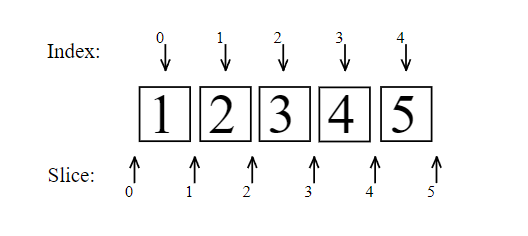
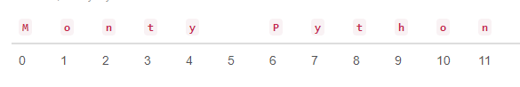
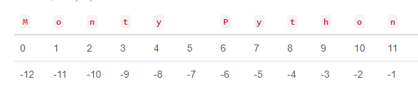
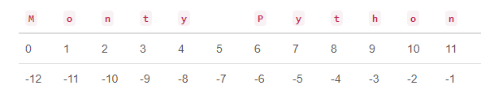

# Dátový typ reťazec a operácie s nimi
Reťazec (string) – je postupnosť znakov uzavretá v apostrofoch ' ' alebo uvodzovkách " ". 
> **Bližšie sa o znakoch a ich kódoch dozvieme z ťaháku "21_znaky_kody.pdf"**
 
 Tieto reťazce viem epriradiť do premennej, vieme ich zreťaziť (spojiť) pomocou operátora + , vieme ich násobiť pomocou operátora * a vytvoriť tak zlepenie viacerých kópii, vieme z vzrobiť čísla pomocou funkcie int() a float() ako aj spätne z čísla vytvoriť reťazec funkciou str(). V neposlednom prípade ako sme to už mohli vidiet v predoslých častiach vieme reťazec zobraziť na display a vytvoriť jeho výstup pomocou funkcie print() a opačne ho ako vstup prijať z klávesnice pomocou funkcie input():
~~~
> * print("Miesto dvojitých úvodzoviek môžeme použiť jednoduché úvodzovky")
> * slovo = input('Napíš nejaké slovo na klávesnici!') # program to spracuje až po stlačení Enter
print("Napísal si slovo :" + slovo) #
a toto sa vypíše na display
~~~
~~~
dokaz = str("Týmto zobrazíme aký dátový typ je reťazec")
print(type(dokaz)) 
<class 'str'>   # potvrdenie datového typu string
~~~
Ako vidieť reťazce sa môžu zapisovať alebo pomocou jednoduchých alebo pomocou dvojitých lebo sú ekvivalentné. Keď sa použijú dvojité uvodzovky, tak je jednoduchá uvodzovka chápaná ako obyčajný znak a naopak čím sa potom nemusí pred uvodzovkou používať spätné lomítko \' resp. \". 
~~~
>>> type("hello 'world'")
<class 'str'>
>>> type('hello "world"')
<class 'str'>
>>> print("hello \"world\"")
hello "world"
~~~
Reťazec môže byt umiestnený aj 3-mi uvodzovkami (dvojitými nebo jednoduchými). Potom se za koniec reťazca pokladá iba sekvencia 3-ich uvodzoviek (apostrfov) a môžeme reťazec napísať aj na niekoľko riadkov.
~~~
>>> x = """veta plna "uvodzoviek" a 'uvodzoviek'''"""
>>> print(x)
veta plna "uvodzoviek" a 'uvodzoviek'''
>>> x = '''Veta napísaná
           na niekoľkých riadkoch. Všimnite si pri tom že na medzerách
na začiatkoch riadkov záleží!'''
>>> print(x)
Veta napísaná
           na niekoľkých riadkoch. Všimnite si pri tom že na medzerách
na začiatkoch riadkov záleží!
~~~
Python nepoužíva na rozdiel od niektorých iných programovacích jazykov datový typ pre jeden znak (char). No miesto toho používa reťazec o veľkosti jedného znaku t.j. reťazec dĺžky 1.

Reťazce sú teda tvorené viacerými znakmi a existujú tu aj špeciálne znaky ako napr. \n (n ako new line), 
\\ zápis miesto jedného spätného lomítka, \' je zápis jednoduchej uvodzovky v texte, \" detto pre ale dvojitú uvodzovku, či \t apre tabulátor (posun o 8 pozícii) atď. 

Vybrat z nich jeden odkaz ktorý ma aj priklady:
https://chercher.tech/python-programming/python-special-characters?utm_content=cmp-true 

https://www.scaler.com/topics/escape-sequence-in-python/

https://www.w3schools.com/python/gloss_python_escape_characters.asp

https://pythonexamples.org/python-escape-characters/

https://python-reference.readthedocs.io/en/latest/docs/str/escapes.html

~~~
>>> print('pozor na uvozovky\t\'!\'\n\n\n')
pozor na uvozovky       '!'

>>>
~~~
> Ak nechceme aby sa speciálné znaky interpretovali, napíšeme na začiatok reťazca znak r (bez mezery).
~~~
>>> print(r'pozor na uvozovky\t\'!\'\n\n\n')
pozor na uvozovky\t\'!\'\n\n\n
~~~

# Operácie s reťazcami
Reťazce môžeme sčítať a násobiť. Ak za sebou napíšeme dva reťazcové literály, tak sa spoja v jeden. **POZOR** ale musia to byť fakt reťazcové literály, ak takto zapíšeme napr. literál a funkciu, ktorá vracia reťazec, alebo premennú tak to nefunguje.
~~~
>>> x = 'abc'
>>> x = x + " " + x
>>> print(x)
abc abc
>>> 5 * "X"
'XXXXX'
>>> print("hello" " " "world")
hello world
>>> print("hello " x)
  File "<stdin>", line 1
    print("hello " x)
                   ^
SyntaxError: invalid syntax
~~~
## Dĺžka reťazca
Pre ďalšie operácie s reťazcami musíme použiť štandardné funkcie. Prvou z nich je funkcia **len()** ktorá nám vráti dĺžku reťazca pričom špecialne znaky ako '\n', '\'' a pod. reprezentujú iba jeden znak:
~~~
>>> a = 'Python'
>>> len(a)
6
>>> len('Peter\'s dog')
11
>>> len('\\\\\\')
3
~~~
## Operácia in
Nám slúži na to aby sme zistili, či sa v reťazci nachádza nejaký konkrétny znak. Je to binárna operácia, ktorá zisťuje, či sa zadaný podreťazec nachádza v nejakom konkrétnom reťazci. Najčastejšie sa použía v rozhodovaní pomocou **if** a cykloch pomocou **while**. Jej tvar je:
> *podretazec* **in** *retazec*
~~~
>>> 'nt' in 'Monty Python'
True
>>> 'y P' in 'Monty Python'
True
>>> 'tyPy' in 'Monty Python'
False
>>> 'pyt' in 'Monty Python'
False
~~~
## Rez reťazca (slice) a operácia kladného indexovania
Keď chceme označiť časť reťazca použijeme na to tzv. rez. Tento postup sa dá použiť aj na iných datových typoch ako sú zoznamy a n-tice ktorými sa budeme zaoberať neskôr. K jednotlivým znakom reťazca pristupujeme tak že im postupne priradíme číselné označenie ktoré nazývame **indexom**. V tejto súvislosti hovoríme o indexovaní. Indexy uvádzame v hranatých zátvorkách [] ktoré vlastne predstavujú operátor na označenie prvku v reťazci. Inými slovami povedané do hranatých zátvoriek zapisujeme index položky ktorú chceme získať. 
> **reťazec[prvy_index : posledny_index]**

>**POZOR:** posledny_index je index prvku jeden za, t.j. musíme písať index prvku o 1-ku viac

> * Prvý znak má index 0, druhý 1 atď.
> * Posledny označujeme číslom -1, predposledný -2 atď.

Obrázok indexovania reťazca '12345' a vytvorenie rezov (slice)

~~~
>>> x = '12345'
>>> x[0]
'1'
>>> x[4]
'5'
>>> x[-1]
'5'
~~~
Slice tiež používa hranaté zátvorky aj vtedy keď vo vnútri nie je jeden index, ale dvojica indexov oddelená dvojbodkou [:]. Táto dvojica označuje začiatok a koniec rozsahu, ktorý chceme získat a v tejto súvislosti hovoríme o **podreťazcoch**. 

~~~
>>> x[0:2]
'12'
>>> x[2:]
'345'
>>> x[2:-2]
'3'
>>> x[1:-2]
23
>>> x[:]
'12345'
~~~

Obrázok indexovania reťazca 'Monty Python' a vytvorenie rezov (slice)
~~~
>>> abc = 'Monty Python'
>>> abc[3]
't'
>>> abc[9]
'h'
>>> abc[12]
...
IndexError: string index out of range
>>> abc[len(abc)-1]
'n'
~~~
**POZOR:** Vidíme, že posledný znak v reťazci má index dĺžka reťazca-1. Ak indexujeme väčším číslom ako 11, vyvolá sa chybová správa IndexError: string index out of range.
~~~
>>> abc = 'Monty Python'
>>> abc[6:11]
'Pytho'
>>> abc[6:12]
'Python'
>>> abc[6:len(abc)]
'Python'
>>> abc[6:12]
'Python'
>>> abc[10:16]
'on'
~~~
Index pred ako aj index za dvojbodkou sa môže v slice vynechat. Potom výber začína od začiatku, resp. pokračuje do konca. V extrémnom prípade, kdy se vynechajú oba indexy, tak sa vyberie všetko. V takýchto prípadoch používame tzv. **predvolené hodnoty**

~~~
>>> abc = 'Monty Python'
>>> abc[6:]                  # od 6. znaku do konca
'Python'
>>> abc[:5]                  # od zaciatku po 4. znak
'Monty'
>>> abc[-4:]                 # od 4. od konca az do konca
'thon'
>>> abc[16:]                 # indexujeme mimo retazca
''
~~~
## Podreťazce s krokom
Pri indexoch podreťazca môžeme určiť aj krok indexov kde krok určuje o koľko sa bude index v reťazci posúvať od prvého po posledný:
> **reťazec[prvy_index : poslednz_index : krok]**
~~~
>>> abc = 'Monty Python'
>>> abc[2:10:2]
'nyPt'
>>> abc[::3]
'MtPh'
>>> abc[9:-7:-1]
'htyP'
>>> abc[::-1]
'nohtyP ytnoM'
>>> abc[6:] + ' ' + abc[:5]
'Python Monty'
>>> abc[4::-1] + ' ' + abc[:5:-1]
'ytnoM nohtyP'
>>> (abc[6:] + ' ' + abc[:5])[::-1]
'ytnoM nohtyP'
>>> 'kobyla ma maly bok'[::-1]
'kob ylam am alybok'
>>> abc[4:9]
'y Pyt'
>>> abc[4:9][2]          # aj podretazce mozeme dalej indexovat
'P'
>>> abc[4:9][2:4]
'Py'
>>> abc[4:9][::-1]
'tyP y'
~~~

## Operácia záporného indexovania
Často potrebujeme pristupovať ku znakom na konci reťazca an čo využívame zapisovanie pomocou záporných indexov:

Obrázok záporného indexovania reťazca 'Monty Python' a vytvorenie rezov (slice)

Znaky reťazca sú indexované od -1 do -len() a napr. pre 5-ty index nášho príkladu platí že abc[-5] == abc[len(abc)-5]
~~~
>>> abc = 'Monty Python'
>>> abc[len(abc)-5]
'y'
>>> abc[-1]
'n'
>>> abc[-7]
' '
>>> abc[-13]
...
IndexError: string index out of range
~~~
## Reťazce sú v pamäti nemenné (nemeniteľné)¶
Dátový typ str, t.j. znakové reťazce, je nemeniteľný typ (**immutable**). To znamená, že hodnota reťazca sa v pamäti zmeniť nedá. 
>Ak budeme potrebovať reťazec, v ktorom je nejaká zmena, budeme musieť skonštruovať nový.
~~~
>>> abc[6] = 'K'
TypeError: 'str' object does not support item assignment
~~~
Všetky doterajšie manipulácie s reťazcami nemenili reťazec, ale zakaždým vytvárali úplne nový (niekedy to bola len kópia pôvodného), napr.
~~~
>>> cba = abc[::-1]
>>> abc
'Monty Python'
>>> cba
'nohtyP ytnoM'
~~~
Takže, keď chceme v reťazci zmeniť nejaký znak, budeme musieť skonštruovať nový reťazec, napr. takto:
~~~
>>> abc[6] = 'K'
...
TypeError: 'str' object does not support item assignment
>>> novy = abc[:6] + 'K' + abc[7:]
>>> novy
'Monty Kython'
>>> abc
'Monty Python'
~~~
Alebo, ak chceme opraviť prvý aj posledný znak:
~~~
>>> abc = 'm' + abc[1:-1] + 'N'
>>> abc
'monty PythoN'
~~~
# Porovnanie reťazcov
Rozlišujeme porovnávanie jednoznakových a dlhších reťazcov.
## Porovnávanie jednoznakových reťazcov
Jednoznakové reťazce môžeme porovnávať relačnými operátormi ==, !=, <, <=, >, >=, napr.
~~~
>>> 'x' == 'x'
True
>>> 'm' != 'M'
True
>>> 'a' > 'm'
False
>>> 'a' > 'A'
True
~~~
Python na porovnávanie používa vnútornú reprezentáciu Unicode (UTF-8). S touto reprezentáciou môžeme pracovať pomocou funkcií **ord()** a **chr()**:

>funkcia **ord(znak)** vráti vnútornú reprezentáciu znaku (kódovanie v pamäti počítača)
~~~
>>> ord('a')
97
>>> ord('A')
65
~~~
>opačná funkcia **chr(číslo)** vráti jednoznakový reťazec, pre ktorý má tento znak danú číselnú reprezentáciu
~~~
>>> chr(66)
'B'
>>> chr(244)
'ô'
~~~
>Pri porovnávaní dvoch znakov sa porovnávajú ich vnútorné reprezentácie, t.j.
~~~
>>> ord('a') > ord('A')
True
>>> 97 > 65
True
>>> 'a' > 'A'
True
~~~
Tieto funkcie sa používajú aj na prevod znaku na číslo a späť. Znaky sa prevádzajú na čísla o desiatkovom základu
pomocou funkcie ord(). Späť sa prevádzajú funkciou
chr(). Každý znak má svoju číselnú hodnotu. A keďže Unicode
v sebe zahŕňa ASCII, tak čísla "základných znakov", možno zistiť pomocou ASCII tabuľky.
~~~
print(ord("a"))
print(chr(97))
~~~
## Porovnávanie dlhších reťazcov
Dlhšie reťazce Python porovnáva postupne po znakoch:

* kým sú v oboch reťazcoch rovnaké znaky, preskakuje ich
* pri prvom rôznom znaku, porovná tieto dva znaky

Napr. pri porovnávaní dvoch reťazcov ‚kocur‘ a ‚kohut‘:
* porovná 0. znaky: 'k' == 'k'
* porovná 1. znaky: 'o' == 'o'
* porovná 2. znaky: 'c' <  'h' a tu aj skončí porovnávanie týchto reťazcov
  
Preto platí, že 'kocur' < 'kohut'. Treba si dávať **pozor na znaky s diakritikou**, lebo, napr. ord('č') = 269 > ord('h') = 104. Napr.
~~~
>>> 'kocúr' < 'kohút'
True
>>> 'kočka' < 'kohut
False
>>> 'PYTHON' < 'Python' < 'python'
True
~~~

## Formátovanie reťazca
Formátovanie reťazcov sa týka najmä použivania funkcie format() s ktorou sa budeme zaoberať pri téme o funkciach v programovacom jazyku Python. Na tomto mieste je však spomenutie tejto problematiky aktuálne preto, že nám umožnuje vkladať do reťazca obsah nejakej premennej čo sa veľmi často používa najmä pri funkcii print(). okrajovo túto tému spomenúť z dôvodu že formátovanie textu pri výpise reťazcov pomocou funkcie print je veľmi efektívné a prirodzené. Stačí totiž použiť jednoduchý klúč (f'Text s {menom_premennej} v záatvorke') Posúdte sami ako efektívne možno vložiť obsah premennej s reťazcom do iného reťazca:
~~~
meno_premennej = 'Adam'
print('Ahoj '+ meno +', rád Ťa spoznávam.') # klasická forma výpisu
print(f'Ahoj {meno}, rád Ťa spoznávam.') # formátovaná forma výpisu
~~~
> ***Túto technologiu si treba zapamätať a používať !!!***
