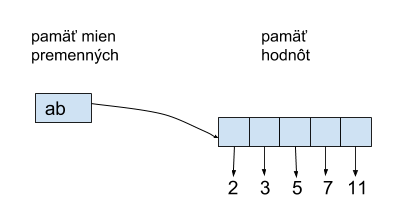

Pokračovanie č. I

## Ďalšie operácie so zoznamami

> ## Indexovanie
Indexovanie pomocou hranatých zátvoriek [ ] - je úplne rovnaké ako pri reťazcoch: indexom je celé číslo od 0 do počet prvkov zoznamu - 1, alebo je to záporné číslo, napríklad:
~~~
>>> teploty = [10, 13, 15, 18, 17, 12, 12]
>>> nakup = ['chlieb', 'mlieko', 'rozky', 'jablka']
>>> studenti = ['Juraj Janosik', 'Emma Drobna', 'Ludovit Stur', 'Pavol Habera', 'Margita Figuli']
>>> zviera = ['pes', 'Dunco', 2011, 35.7, 'hneda']
>>> prazdny = []      # prázdny zoznam

>>> zviera[0]
    'pes'
nakup[1]
    'mlieko'
studenti[-1]
    'Margita Figuli'

>>> ['red', 'blue', 'yellow', 'green'][1]
    'blue'
>>> ['red', 'blue', 'yellow'][2][4]
    'o'
~~~

> ## Zreťazenie 
Zreťazenie pomocou operácie + označuje, že vytvoríme nový väčší zoznam, ktorý bude obsahovať najprv prvky prvého zoznamu a **za tým** všetky prvky druhého zoznamu, napríklad:
~~~
>>> nakup = ['chlieb', 'mlieko', 'rozky', 'jablka']
>>> nakup2 = ['zosity', 'pero', 'vreckovky']
>>> nakup + nakup2
    ['chlieb', 'mlieko', 'rozky', 'jablka', 'zosity', 'pero', 'vreckovky']

>>> studenti = ['Juraj Janosik', 'Emma Drobna', 'Ludovit Stur', 'Pavol Habera', 'Margita Figuli']
>>> studenti = studenti + ['Karel Capek']
>>>> studenti
    ['Juraj Janosik', 'Emma Drobna', 'Ludovit Stur', 'Pavol Habera', 'Margita Figuli', 'Karel Capek']

>>> prazdny = []      # prázdny zoznam
>>> prazdny + prazdny
    []

>>> [1] + [2] + [3, 4] + [] + [5]
    [1, 2, 3, 4, 5]
~~~

> ## Viacnásobné zreťazenie
Viacnásobné zreťazenie pomocou operácie * označuje, že daný zoznam sa navzájom zreťazí určený počet krát, napríklad:
~~~
>>> jazyky = ['Python', 'Pascal', 'C++', 'Java', 'C#']
>>> vela = 3 * jazyky
vela
    ['Python', 'Pascal', 'C++', 'Java', 'C#', 'Python', 'Pascal', 'C++', 'Java', 'C#', 'Python',
     'Pascal', 'C++', 'Java', 'C#']

>>> sto_krat_nic = 100 * [None]
>>> sto_krat_nic
    [None, None, None, None, None, None, None, None, None, None, None, None, None, None, None,
     None, None, None, None, None, None, None, None, None, None, None, None, None, None, None,
     None, None, None, None, None, None, None, None, None, None, None, None, None, None, None,
     None, None, None, None, None, None, None, None, None, None, None, None, None, None, None,
     None, None, None, None, None, None, None, None, None, None, None, None, None, None, None,
     None, None, None, None, None, None, None, None, None, None, None, None, None, None, None,
     None, None, None, None, None, None, None, None, None, None]

>>> prazdny = []      # prázdny zoznam
>>> prazdny * 1000
    []
~~~

## Zisťovanie existencie prvku
Zisťovanie prvku sa uskutočňuje pomocou funkcie **in** označuje, či sa nejaká hodnota nachádza v danom zozname, napríklad:
~~~
>>> studenti = ['Juraj Janosik', 'Emma Drobna', 'Ludovit Stur', 'Pavol Habera', 'Margita Figuli']
>>> 'Pavol Habera' in studenti
    True

>>> nakup = ['chlieb', 'mlieko', 'rozky', 'jablka']
>>> 'pero' in nakup
    False
>
>> jazyky = ['Python', 'Pascal', 'C++', 'Java', 'C#']
>>> 'pascal' in jazyky
    False   # kvoli malemu p v slove pascal

>>> sto_krat_nic = 100 * [None]
>>> prazdny in sto_krat_nic
    False

>>> teploty = [10, 13, 15, 18, 17, 12, 12]
>>> 18 in teploty
    True

>>> teploty = [10, 13, 15, 18, 17, 12, 12]
>>> [18, 17] in teploty     # zoznam v zozname nevie
    False
~~~
V poslednom príklade testujeme, či sa dvojprvkový zoznam [18, 17] nachádza niekde v zozname teploty. Lenže tento zoznam obsahuje len celé čísla a žiaden prvok nie je typu zoznam. Hoci pre znakové reťazce fungovalo hľadanie podreťazca, napríklad:
~~~
>>> 'th' in 'Python'
    True
~~~
pre zoznamy táto analógia nefunguje.

Ešte si pripomeňte zápis negácie takéhoto testu, ktorý analogicky funguje pre reťazce aj zoznamy:
~~~
>>> not 'Y' in 'Python'
    True

>>> 'Y' not in 'Python'
    True

>>> 'str' not in ['pon', 'uto', 'str', 'stv', 'pia', 'sob', 'ned']
    False

>>> 'štv' not in ['pon', 'uto', 'str', 'stv', 'pia', 'sob', 'ned']
    True
~~~
> **Pripomeňme si, ako vyzerajú premenné a ich hodnoty v pamäti Pythonu.**

 Urobme toto priradenie:
 ~~~
 ab = [2, 3, 5, 7, 11]
 ~~~
 Do pamäti mien (globálny menný priestor) pribudne jeden identifikátor premennej ab a tiež referencia (odkaz) na päťprvkový zoznam [2, 3, 5, 7, 11]. Tento zoznam môžeme v pamäti hodnôt vizualizovať ako päť vedľa seba položených škatuliek, pričom v každej je referencia na príslušnú hodnotu:

 

 Je dobre si uvedomiť, že momentálne máme v pamäti 6 premenných, jedna z nich je ab (je typu list) a zvyšných päť je ab[0], ab[1], ab[2], ab[3] a ab[4] (všetky sú typu int).

Pokračovanie č. II

